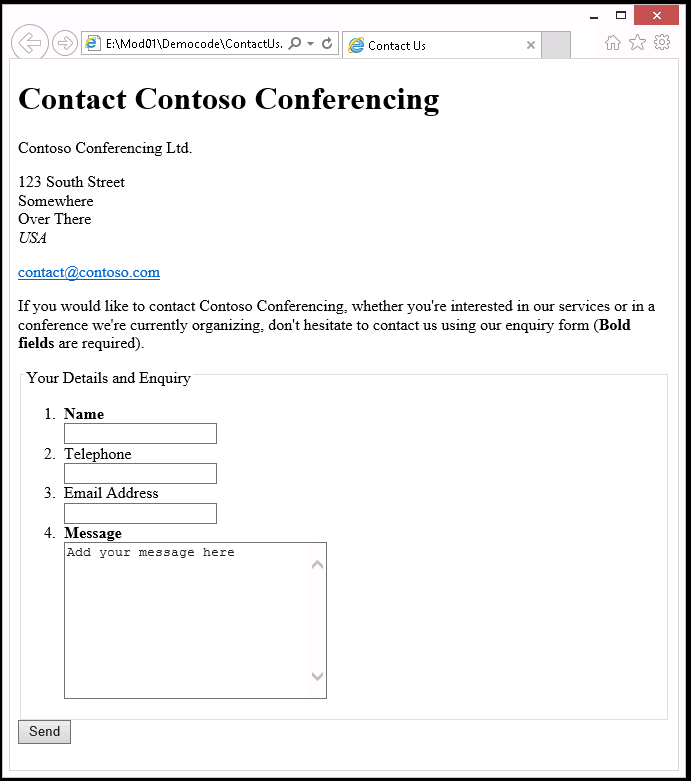

# Module 1: Overview of HTML and CSS
Wherever a path to a file starts with *[Repository Root]*, replace it with the absolute path to the folder in which the 20480 repository resides. For example, if you cloned or extracted the 20480 repository to **C:\Users\John Doe\Downloads\20480**, change the path: **[Repository Root]\AllFiles\20480C\Mod01** to **C:\Users\John Doe\Downloads\20480\AllFiles\20480C\Mod01**.
# Lesson 1: Overview of HTML

### Demonstration: Creating a Simple Contact Form

#### Preparation Steps 

1. Ensure that you have cloned the 20480C directory from GitHub **(https://github.com/MicrosoftLearning/20480-Programming-in-HTML5-with-JavaScript-and-CSS3/tree/master/Allfiles)**. It contains the code segments for the labs and demos in this course.
2. Browse to **[Repository Root]/Allfiles/Mod01/Democode**, and then open the **DemoWebSite - Complete.sln** file.
3. Run the **DemoWebSite - Complete.sln** application.
4. In Microsoft Edge, on the address bar, note the port number that appears after **http://localhost:**. You will use this port number during this demonstration.
5. Close Microsoft Edge.


### Demonstration Steps

#### Create an HTML page

1. Open Notepad.
2. To the blank text file, add the following basic HTML structure:
   ```html
       <!DOCTYPE HTML>
        <html lang="en">
            <head>
              <meta charset="UTF-8" />
              <title>Contact Us</title>
            </head>
            <body>

            </body>
        </html>
   ```
3. Save the file as **[Repository Root]\Allfiles\Mod01\Democode\ContactUs.html**.

#### Add content to the page

1.	In the **&lt;body&gt;** element, add a level 1 page heading:
   ```html
    <h1>Contact Contoso Conferencing</h1>
   ```
2.  Add the company address by using two paragraphs and a line break element:
    ```html
    <p>Contoso Conferencing Ltd.</p>
    <p>
        123 South Street<br />
        Somewhere<br />
        Over There<br />
        <em>USA</em>
    </p>
    ```
3.	For the company's contact email address, add a hyperlink. Note the use of the **mailto** protocol rather than the more common http.
   ```html
    <p>
        <a href="mailto:contact@contoso.com">
        contact@contoso.com</a>
    </p>
   ```
4.	To invite users to use the contact form, add the following text:
   ```html
    <p>
        If you would like to contact Contoso Conferencing, whether you're interested in our services or in a conference we're currently organizing, don't hesitate to contact us by using our enquiry form. (<strong>Bold fields</strong> are required.)
    </p>
   ```
5.	Save the file.

#### Add a form with input controls
1.	In the page, below the previously added text, add the following **form** element:
   ```html
    <form method="Post" action="support.aspx">
    </form>
   ```
2. Between the **&lt;form …&gt;** tag and the **&lt;/form&gt;** tag, add a **fieldset** element and a **submit** button.
   ```html
    <fieldset>
        <legend>
            Your Details and Enquiry
        </legend>
    </fieldset>
    <input type="submit" value="Send" />
   ```
3.	In the **&lt;fieldset&gt;** element, below the **&lt;/legend&gt;** tag, add the unordered list in the following code sample.  This list contains input elements for the user's name, telephone number, email address, and a message.
   ```html
    <ol>
        <li>
          <label>
            <strong>Name</strong><br />
            <input type="text" 
                   name="UserName" />
          </label>
        </li>
        <li>
          <label>
            Telephone<br />
            <input type="text" 
                   name="Phone" />
          </label>
        </li>
        <li>
          <label>
            Email Address<br />
            <input type="text" 
                   name="Email" />
          </label>
        </li>
        <li>
          <label>
            <strong>Message</strong><br />
            <textarea name="Message" 
              cols="30" rows="10">Add your message here
            </textarea>
          </label>
        </li>
    </ol>
   ```

4.	Save the file, and then close Notepad.

### View the page

1.	Open File Explorer.
2.	Browse to **[Repository Root]\Allfiles\Mod01\Democode**.
3.	To display the page in Microsoft Edge, double-click **ContactUs.html**.
4.	If the **How do you want to open this type of file (.html)?** dialog box appears, select **Microsoft Edge**.



# Lesson 3: Creating a Web Application by Using Visual Studio 2017

### Demonstration: Creating a Website by Using Visual Studio 2017

#### Preparation Steps 

1. Ensure that you have cloned the 20480C directory from GitHub **(https://github.com/MicrosoftLearning/20480-Programming-in-HTML5-with-JavaScript-and-CSS3/tree/master/Allfiles)**. It contains the code segments for the labs and demos in this course. 


#### Demonstration Steps

#### Create a website project

1.	Open Microsoft Visual Studio 2017.
2.	In  Microsoft Visual Studio, on the **File** menu, point to **New**, and then click **Project**.
3.	In the **New Project** dialog box, Select **Web**, click **ASP.NET Web Application(.NET Framework)**.

>**Note**: It does not matter whether you select the **Visual Basic** or **Visual C#** templates in the left pane; the templates for both languages enable you to create HTML5 webpages and implement functionality by using JavaScript.
4. In the **Name** text box enter **DemoWebSite**.
5.	From the location drop-down list, set the file path to **[Repository Root]\Allfiles\Mod01\Democode\DemoWebSite**, and then click **OK**.
6. In **New ASP.NET Web Application-DemoWebSite**, Select **Empty**, and then click **OK**.

### Add and edit files in the project

1.	In **DemoWebSite - Microsoft Visual Studio**, click **Solution Explorer**.
2.	In Solution Explorer, right-click the **DemoWebSite** project, point to **Add**, and then click **Existing Item**.
3.	In the **Add Existing Item - DemoWebSite** dialog box, browse to **[Repository Root]\Allfiles\Mod01\Democode**, click **ContactUs.html**, and then click **Add**.
4.	In Solution Explorer, right-click **ContactUs.html**, and then click **Set As Start Page**.
5.	In Solution Explorer, right-click the **DemoWebSite** project, point to **Add**, click **New Folder**, and then name it **styles**.
6.	Right-click the **styles** folder, point to **Add**, and then click **New Item**.
7.	In the **Add New Item - DemoWebSite** dialog box, in the middle pane, click **Style Sheet**. In the **Name** box, enter **ContactUsStyles.css**, and then click **Add**.

>**Note**: You can also use the **Add New Item - DemoWebSite** dialog box to create new JavaScript and HTML files and add them to a project.

8.	In the **ContactUsStyles.css** file, add the following style:
   ```css
        body {
            font-family: 'Times New Roman';
            color: blue;
        }
   ```
9.	In Solution Explorer, double-click **ContactUs.html**.
10. On the page, add the following markup to the **&lt;head&gt;** element:
   ```html
        <head>
            <meta charset="UTF-8" />
            <title>Contact Us</title>
            <link href="styles/ContactUsStyles.css" rel="stylesheet" type="text/css" />
        </head>
   ```
>**Note**: HTML IntelliSense provides hints to help ensure that you enter valid HTML. The **Pick URL** wizard enables you to quickly select a style sheet.

11. On the **File** menu, click **Save All**.

#### Run the web application
1.	In DemoWebSite - Microsoft Visual Studio, on the **Debug** menu, click **Start Debugging**.
2.	If the **Debugging Not Enabled** dialog box appears, click **Modify the Web.config file to enable debugging**, and then click **OK**.
3.	Verify that Microsoft Edge starts running and displays **ContactUs.html**. The text for the page should appear in blue.
4.	In Microsoft Edge, if the **Intranet settings are turned off by default** message appears, click **Don’t show this message again**.

>**Note**: You can enter some sample data, but do not click **Send** because the URL that is the target of the form is not available.


#### Modify the live application
1.	Switch to **DemoWebSite - Microsoft Visual Studio**.
2.	In the **ContactUs.html** file, make the following modifications:
   - Change **&lt;strong>Name</strong&gt;** to **&lt;strong>Full name</strong&gt;**.
   - Change **Telephone** to **Telephone number**.
3.	In the **ContactUsStyles.css** file, add the following style:
    ```css
        h1 {
            font-family: 'Copperplate Gothic';
            color: red;
        }
    ```
4.	On the **File** menu, click **Save All**.
5.	To refresh the display, return to Microsoft Edge and press F5.
6.	Verify that the **Name** field changed to **Full name**, the **Telephone** field changed to **Telephone number**, and that the style of the heading has changed.
7.	Return to **DemoWebSite - Microsoft Visual Studio**.
8. On the **Debug** menu, click **Stop Debugging**.

### Demonstration: Exploring the Contoso Conference Application

#### Preparation Steps 

1. Ensure that you have cloned the 20480C directory from GitHub (**https://github.com/MicrosoftLearning/20480-Programming-in-HTML5-with-JavaScript-and-CSS3/tree/master/Allfiles**). It contains the code segments for the labs and demos in this course. 

#### Demonstration Steps

1.	Read the lab scenario to the students and point out that they should read each scenario before attempting the lab for a module.
2.	Point out to the students that the Exercise Scenario for each exercise contains a description of what they will accomplish in the exercise, and is also essential reading.
3.	Start Microsoft Visual Studio 2017, and then from the [Repository Root]\Allfiles\Mod01\Labfiles\Starter folder, open the ContosoConf.sln solution.
>**Note**: If **Security Warning for ContosoConf** dialog box appears, clear **Ask me for every project in this solution** checkbox and then click **OK**. 
4.	In Solution Explorer, expand the **ContosoConf** project, and then in the root folder of the project, highlight the **.htm** files. (These files correspond to each webpage that students will build in the labs throughout the course.)
5.	In Solution Explorer, expand the **styles** folder. Point out that this folder contains the global stylesheets used by all the pages in the application.
6.	Expand the **pages** folder, and describe how each page also has its own stylesheet that contains the styles required for that page.
7.	To display the stylesheet in Visual Studio Code, double-click **index.css**. Scroll through this stylesheet and emphasize that this stylesheet contains the styles that will be used in the home page (**index.htm**).
8. In Solution Explorer, expand the **scripts** folder. Explain that this folder contains the global JavaScript code files used throughout the application.
9. Expand the **pages** folder, and describe how most of the webpages also have their own code file that contains the JavaScript code specifically for that page.
10. To display the JavaScript code in Visual Studio Code, double-click **video.js**. Scroll through this file and explain that this is the code that handles the video player controls on the home page.
11. On the **Debug** menu, click **Start Without Debugging**. Explain that this step saves changes that might have been made to the HTML files, stylesheets, and JavaScript code files, and then starts the web application. It then moves to the home page of the application and displays it in Microsoft Edge.

>**Note**: If the **Intranet settings are turned off by default** message appears, click **Don’t show this message again**.
12.	Point out that the web application runs by using a local instance of Microsoft Internet Information Services (IIS) Express on the virtual machine. Highlight the URL in the address bar of Microsoft Edge.
13.	Quickly visit each page in the application by using the links on the navigation bar at the top of the webpage. 

>**Note**: On the **Location** page, the **localhost wants to track your physical location** message will appear. Click **Allow once**, and then in the **Enable Location Services** dialog box, click **Yes**.

14.	Explain that the first exercise of the lab provides more information about the purpose of each webpage in the application.
15.	Close Microsoft Edge.
16.   Close all open windows.

©2018 Microsoft Corporation. All rights reserved.

The text in this document is available under the [Creative Commons Attribution 3.0 License](https://creativecommons.org/licenses/by/3.0/legalcode), additional terms may apply. All other content contained in this document (including, without limitation, trademarks, logos, images, etc.) are **not** included within the Creative Commons license grant. This document does not provide you with any legal rights to any intellectual property in any Microsoft product. You may copy and use this document for your internal, reference purposes.

This document is provided &quot;as-is.&quot; Information and views expressed in this document, including URL and other Internet Website references, may change without notice. You bear the risk of using it. Some examples are for illustration only and are fictitious. No real association is intended or inferred. Microsoft makes no warranties, express or implied, with respect to the information provided here.
