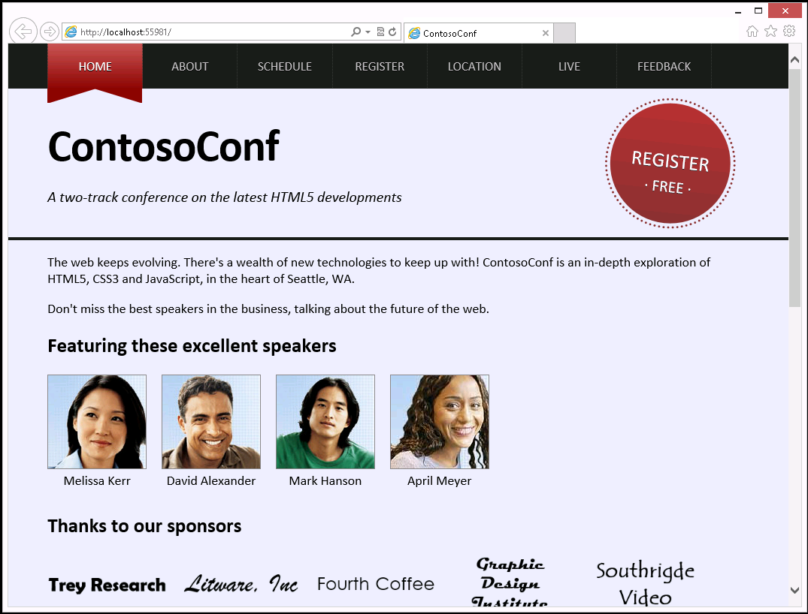
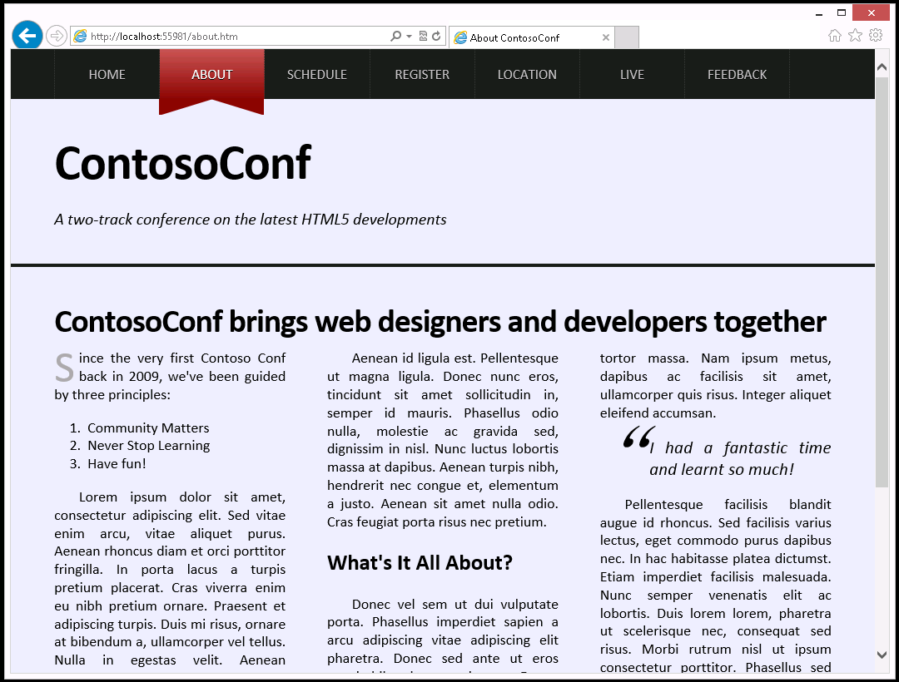
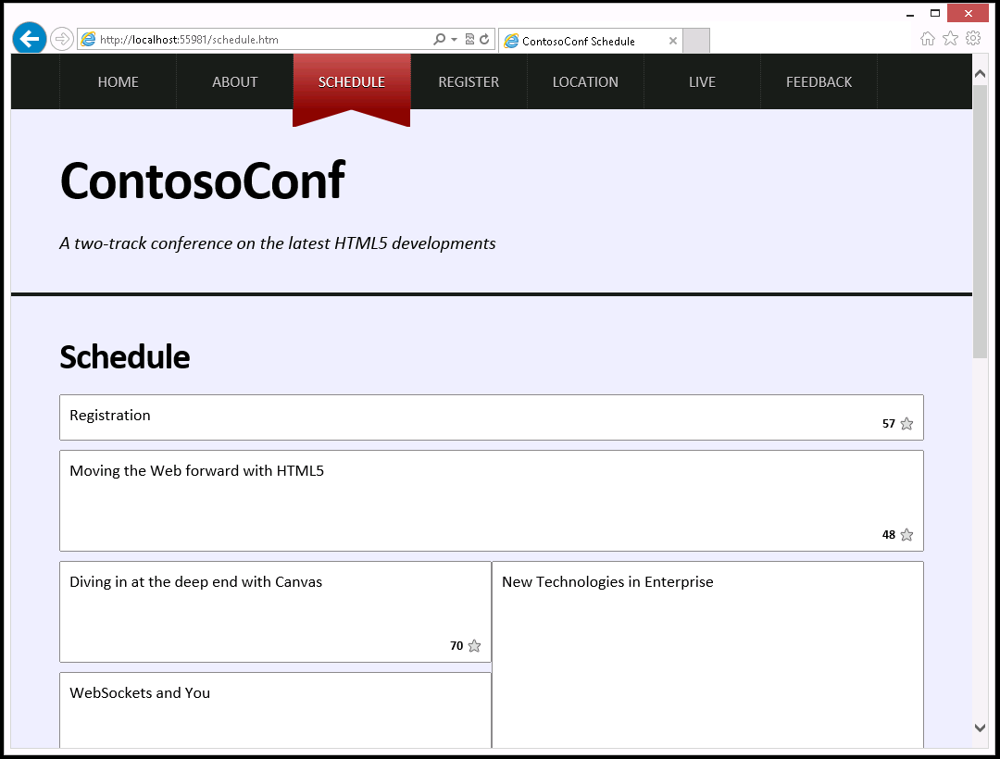
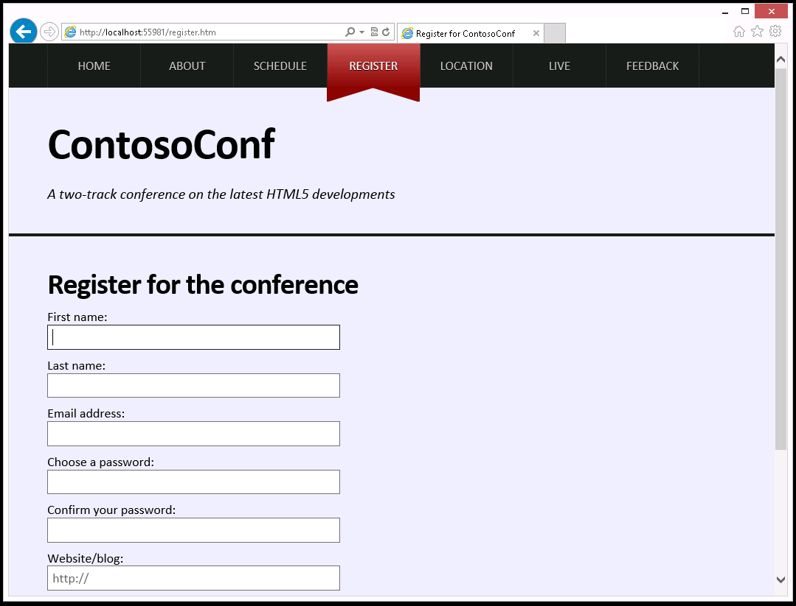
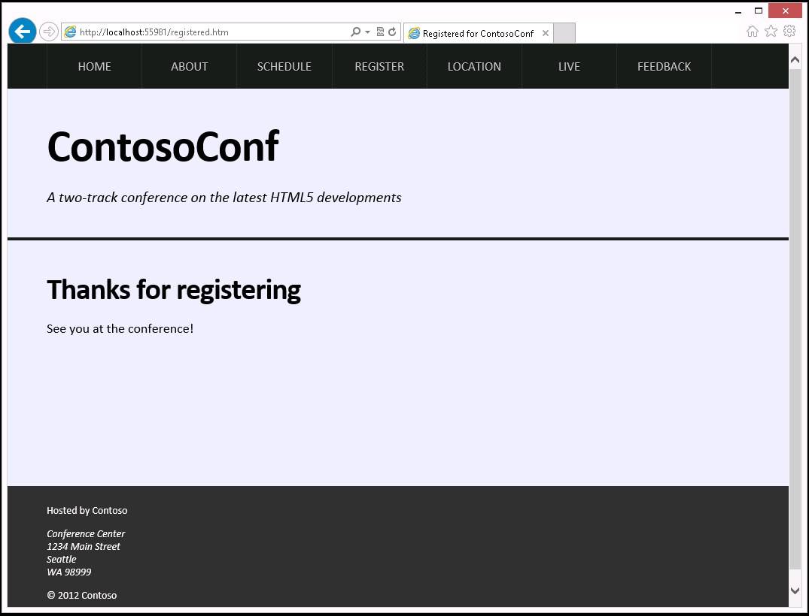
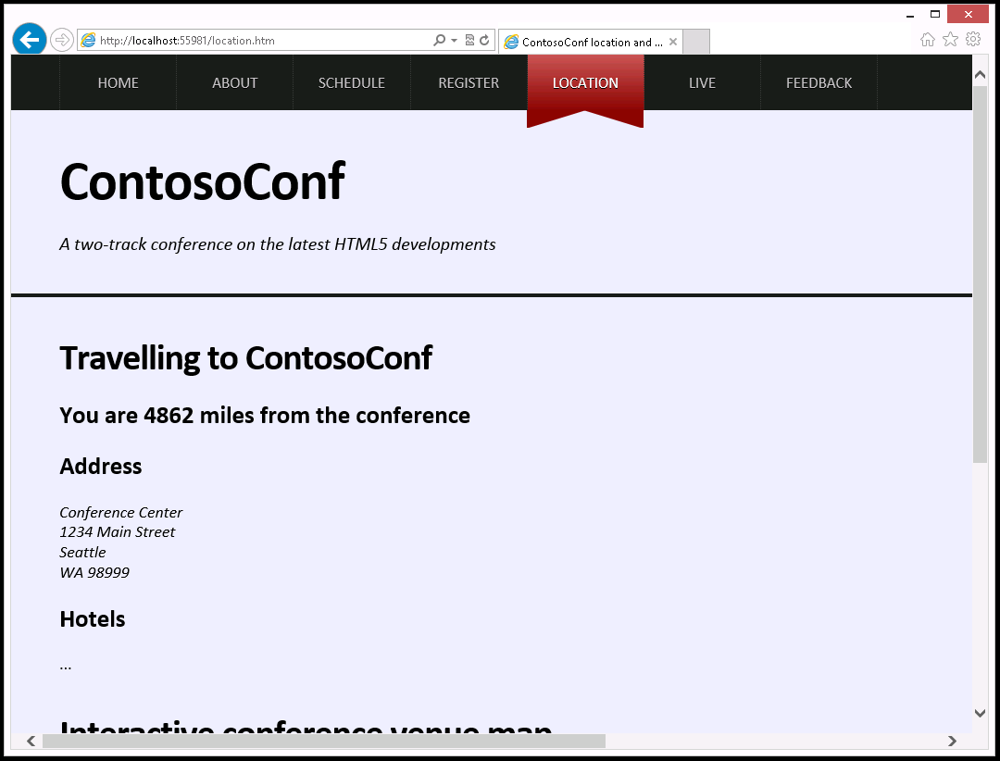
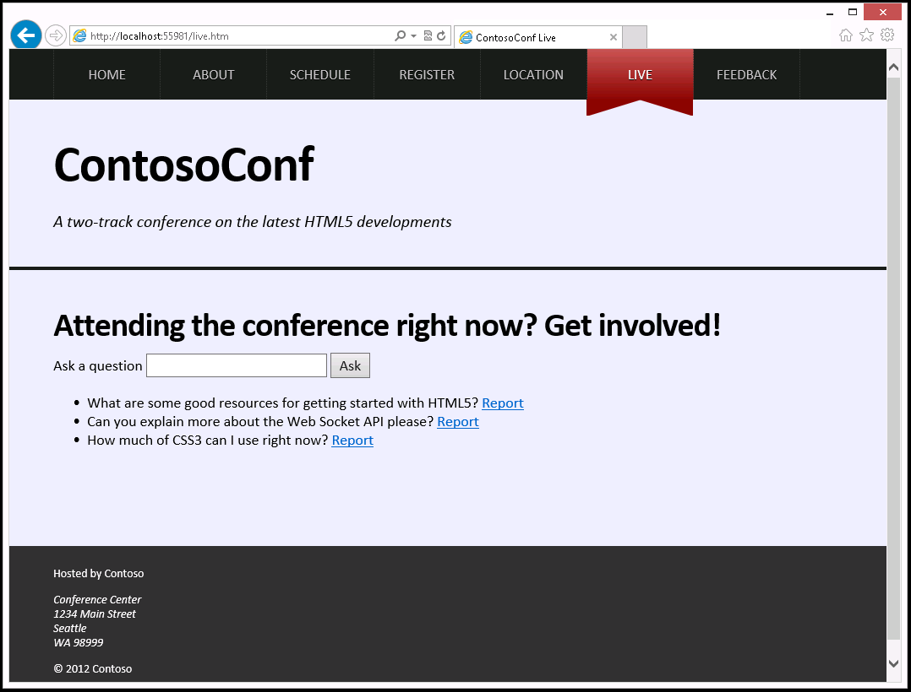
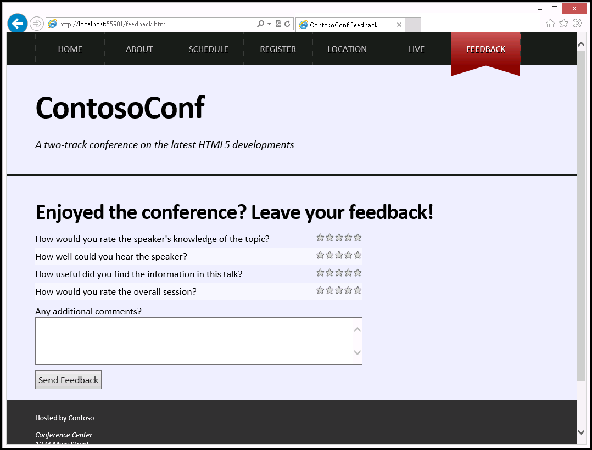

## Module 1: Overview of HTML and CSS

Wherever a path to a file starts with *[Repository Root]*, replace it with the absolute path to the folder in which the 20480 repository resides. For example, if you cloned or extracted the 20480 repository to **C:\Users\John Doe\Downloads\20480**, change the path: **[Repository Root]\AllFiles\20480C\Mod01** to **C:\Users\John Doe\Downloads\20480\AllFiles\20480C\Mod01**.

## Lab: Exploring the Contoso Conference Application

#### Scenario

ContosoConf is an annual technical conference that describes the latest tools and techniques for building HTML5 web applications. The conference organizers have created a website to support the conference, using the same technologies that the conference showcases. 

You are a developer that creates websites by using HTML, CSS, and JavaScript, and you have been given access to the code for the website for the latest conference. You decide to take a look at this web application to see how it works, and how the developer has used Visual Studio 2017 to create it.

#### Objectives

After completing this lab, you will be able to:
- Describe the structure of the Contoso Conference web application.
- Use Visual Studio 2017 to examine the structure of a web application, run a web application, and modify a web application.

#### Lab Setup

Estimated Time: **30 minutes**

### Exercise 1: Exploring the Contoso Conference Application

#### Scenario

In this exercise, you will run the Contoso Conference web application and examine each of the functions it provides.

The Contoso Conference web application contains the following pages:

- The Home page, which provides a brief overview of the conference, the speakers, and the sponsors. The Home page also includes a video from the previous conference.
- The About page, which provides more detail about the conference and the technologies that it covers.
- The Schedule page, which lists the conference sessions. The conference has two concurrent tracks, and the sessions are organized by track. Some sessions are common to both tracks.
- The Register page, which enables the user to provide their details and register for the conference.
- The Location page, which provides information about the conference location and a map of the venue.
- The Live page, which enables an attendee to submit technical questions to the speakers running the conference sessions. The page displays the answer from the speaker, together with questions (with answers) posted by other conference attendees.
- The Feedback page, which enables the user to rate conference sessions and speakers.

#### Task 1: Start the web application and view the Home page.

1.	Start Microsoft Visual Studio.
2.	Open the **ContosoConf** solution in the **[Repositrory Root]\Allfiles\Mod01\Labfiles\Starter** folder
3.	Start the application without debugging.

The graphics elements for the speakers and sponsors are implemented by using HTML **img** elements. The sources of the images are jpg and png files.

4.	Scroll to the bottom of the **Home** page and play the video from the previous conference. This functionality is implemented by using the HTML5 **video** element. 
5.	Pause the video.

6.	Scroll to the top of the **Home** page and hover the mouse over the **Register Free** icon. Notice that the icon rotates and expands as the mouse enters the icon. This feature is implemented by using CSS. 
7.	At the very top of the page, move the mouse over the menu bar listing the names of the pages in the application. Do not click any menu items. Notice that each item is highlighted as the mouse traverses it. This feature is implemented by using an HTML **nav** element and CSS. 

#### Task 2: View the About and Schedule pages.

1.	Using the menu bar, move to the **About** page.

Notice that when you click an item in the menu bar, the style of the item changes; it is displayed with a ribbon effect. This feature is implemented by using CSS.
The other styling features, including the large drop-capital "S" at the start of the first paragraph, the column layout, and the quotation in the third column, are also implemented by using CSS.

2.	Move to the **Schedule** page.

The list of sessions is held in a database that is accessed by using a web service. This page uses JavaScript code to connect to the web service, retrieve the list of sessions, and dynamically populate the body of this page with the session information.
3.	Select the session **Moving the Web forward with HTML5** and click the star icon. When this happens, notice that the star changes color and that number next to the star increases. This number indicates how many attendees have expressed an interest in this session; to get a good seat, the user may need to arrive early for popular sessions. 
4.	Click the star again to deselect the session. The number of interested attendees drops by one. 

The functionality is implemented by a combination of CSS and JavaScript code that sends information to another web service about the sessions that a user selects.

#### Task 3: View the Register page and register as a new attendee.

1.	Move to the **Register** page.

2.	Register the details for a new attendee. Enter the following information and then click **Register**:
- First name: **Eric**
- Last name: **Gruber**
- Email address: **dummy data**

Notice that the page performs the following validations:
- All fields apart from **Website/blog** are mandatory
- The **Email address** must be in the correct format
- The **password** must contain at least 5 letters and numbers
- The value entered for the **Confirm your password** field must match the **password** field

This validation is performed by using a combination of HTML5 forms validation controls, and JavaScript code. The styling of the fields when they display an error is controlled by using CSS.

3.	Complete the data by providing the following information, and then click **Register**:
- Email address: **grubere@contoso.com**
- Choose a password: **abc1234**
- Confirm your password: **wxyz9999**

Notice that this time a different error message appears because the values specified for the two password fields are not the same.

4.	Change the value in the **Confirm your password** field to **abc1234**, and then click **Register** again.

When you have successfully registered, the confirmation page appears.

#### Task 4: View the Location page.

1.	Move to the **Location** page.

If the message **localhost wants to track your physical location** appears in the Microsoft Edge message bar, click **Allow once**. In the **Enable Location Services** message box, click **Yes**.

The page displays information about your current location (the distance from the conference venue) by using the Geolocation API in JavaScript.

2.	Scroll to the bottom of the page. The venue map that appears is generated by using Scalable Vector Graphics.

#### Task 5: Submit a question and provide conference feedback.

1.	Move to the **Live** page.

The **Live** page enables an attendee to submit questions to a speaker and to view the response. The page also displays questions asked by other attendees.
2.	Type the question **What is the best way to learn HTML5?**, and then click **Ask**.
3.	Review the questions that are displayed. This page also enables an attendee to report any questions that they feel are unsuitable or offensive.
4.	Select the question that you just asked and report it. The question will be vetted and then disappear.

Questions and reporting are managed by using a web socket server. The application connects to this server by opening a client connection and sending requests asynchronously. As other attendees post questions, the JavaScript code behind this page automatically updates the list of questions that is displayed.
5.	Move to the **Feedback** page.

The **Feedback** page enables an attendee to provide feedback about a session by selecting a star rating and by providing additional comments.
The star rating is implemented by using a combination of JavaScript code and CSS styles behind HTML5 input fields.
6.	Provide a rating for a session; click the third star adjacent to the first question, the fifth star adjacent to the second question, and the fourth star adjacent to the two remaining questions.
7.	In the **Any additional comments** box, type **Good conference**, and then click **Send Feedback**.

Notice that when you send the feedback, the form flies off the screen to indicate that the feedback has been posted. This animation is performed by using CSS.
8.	Close Microsoft Edge.

>**Results:** After completing this exercise, you will be able to describe the features of the Contoso Conference web application and list the technologies that are used to implement them.

### Exercise 2: Examining and Modifying the Contoso Conference Application.

#### Scenario

In this exercise, you will examine the Visual Studio 2017 project for the Contoso Conference application. You will see how the project is structured, and how the files and scripts for the project are organized into folders. You will then run the application again, make some modifications to the HTML markup and CSS, and view the results.

#### Task 1: Explore the web pages for the application by using Visual Studio 2017.

1.	In **ContosoConf - Microsoft Visual Studio**, open the **index.htm** file. This file contains the HTML markup for the **Home** page as static text. Examine the following items in the file:
- The **nav** element at the start of the **body** section. This element defines the menu that appears at the top of the page (the same menu appears on the other HTML pages as well). The item tagged with the active class specifies the item that refers to the current page. This item is styled differently when it is rendered.
- The section with the **video** class above the page footer. This section implements the video player.
- The **link** elements near the top of the file. These elements specify the CSS files that provide the styling for this page. The index.css style sheet contains the styles specifically for this page, while the other style sheets contain styles that are used throughout the application.
- The **script** elements just before the closing **body** tag. These elements specify the JavaScript files that implement the functionality for this page.

2.	Open the **about.htm** file. This file contains the HTML markup for the **About** page as static text. Notice that:
- This page implements the same navigation menu as the **Home** page. Notice that the **About** item is tagged with the **active** class; this causes the **About** item to be displayed using the ribbon style when it is rendered by using the nav.css stylesheet.
- Styling is handled by a set of CSS files. The about.css style sheet implements the styling specific to this page.

3.	Open the **schedule.htm** file. This file contains the HTML markup for the **Schedule** page. 
In this page, notice that the list of sessions in the **&lt;section class="page-section schedule"&gt;** element is empty; it is populated when the page is displayed by using the JavaScript code in the **schedule.bundel.js** script referenced near the end of the file.

4.	Open the **register.htm** file. This file contains an HTML form in the **&lt;section class="page-section register"&gt;** element. 
This form validates the data that an attendee enters.
When the user submits the form, their details are posted to the registration service at the URL **registration/new**

5.	Open the **location.htm** file. This file contains an HTML page that displays the distance of the user from the conference site, together with a venue map.
The distance to the conference site is calculated by using JavaScript code that calls the Geolocation API, in the script **location.js**. The script displays the distance in the **&lt;h2&gt;** element with the **id** of **distance** in the **&lt;section class="travel"&gt;** element.
The venue map is drawn by using Scalable Vector Graphics in the **&lt;section class="venue"&gt;** element.

6.	View the **live.htm** file.
This file contains a form in the **&lt;section class="page-section Live"&gt;** element that enables a user to submit questions.
Questions are posted to a server listening on a web socket.
Questions posted by other users are received by using a web socket, and then added to the list on the page. 
The JavaScript code that implements the web socket code is located in the **live.bundel.js** file.

7.	View the **feedback.htm** file. This page contains the feedback form in the **&lt;section class="page-section feedback"&gt;** element, enabling attendees to provide their feedback on the conference.
The input fields for the first four questions are rendered as stars by using the JavaScript code in the StartRatingView.js file and the styles in the feedback.css style sheet. Properties of the input fields define the maximum and minimum ratings, and each rating is displayed as a single yellow star.
The input field for the comments feedback is a **&lt;textarea&gt;** element.
When the user submits the feedback, JavaScript code in the feedback.js file and styles in the feedback.css style sheet animate the form to make it fly off the screen. 

#### Task 2: Explore the structure of the project.

1.	The files for the project are organized into the following folders. In Solution Explorer, examine the contents of each folder in turn:
- **images.** This folder contains photographs of the conference speakers, and logos of conference sponsors.
- **scripts.** This folder contains the JavaScript files used throughout the application. The **pages** subfolder contains the JavaScript files containing the code that is specific to each page. Each file is named after the corresponding HTML file.
- **styles.** This folder contains the styles for the application. It is organized in a similar manner to the **scripts** folder. The **images** subfolder contains the graphic image of a star, used by the feedback and schedule pages.

>**Note:** For the purposes of this lab you can ignore the **Controllers** and **Views** folders. These folders contain C# and ASP.NET code that implement the web services used by the application. In the real world, they would be implemented separately from the web application.
You can also disregard the **Properties** and **References** folders, which contain items that support the web services, as does the **Global.asax** file.
You will not use any of these items in this course.

#### Task 3: Run the application and make live modifications.

1.	Build and run the web application without debugging, and display the **Home** page.
2.	Leave the application running and return to **ContosoConf - Microsoft Visual Studio**.
3.	Edit the HTML markup for the Home page and change the text for the **Register Free** button to **Register Now**.
4.	Open the nav.css style sheet in the **styles** folder; this style sheet contains the styles used to render the contents of the **&lt;nav&gt;** element and change the background color to blue.
5.	Save the changes, return to Microsoft Edge, refresh the view, and verify that you can see the effects of the changes.

>**Result:** After completing this exercise, you will be able to describe how the Contoso Conference application is structured as a Visual Studio 2017 project.

©2018 Microsoft Corporation. All rights reserved.

The text in this document is available under the  [Creative Commons Attribution 3.0 License](https://creativecommons.org/licenses/by/3.0/legalcode), additional terms may apply. All other content contained in this document (including, without limitation, trademarks, logos, images, etc.) are  **not**  included within the Creative Commons license grant. This document does not provide you with any legal rights to any intellectual property in any Microsoft product. You may copy and use this document for your internal, reference purposes.

This document is provided &quot;as-is.&quot; Information and views expressed in this document, including URL and other Internet Web site references, may change without notice. You bear the risk of using it. Some examples are for illustration only and are fictitious. No real association is intended or inferred. Microsoft makes no warranties, express or implied, with respect to the information provided here.
