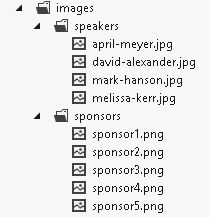
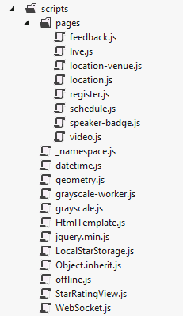
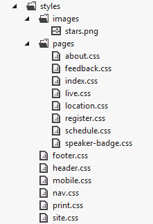

# Module 1: Overview of HTML and CSS.

# Lab: Exploring the Contoso Conference Application.

### Lab Setup

### Preparation Steps

1.	Ensure that you have cloned the 20480C directory from GitHub. It contains the code segments for this course's labs and demos. https://github.com/MicrosoftLearning/20480-Programming-in-HTML5-with-JavaScript-and-CSS3/tree/master/Allfiles.

### Exercise 1: Exploring the Contoso Conference Application.

#### Task 1: Start the web application and view the Home page.

1.	Open **Visual Studio 2017**.
2.	In Visual Studio, on the **File** menu, point to **Open**, and then click **Project/Solution**.
3.	In the **Open Project** dialog box, browse to **Allfiles\Mod01\Labfiles\Starter**, click **ContosoConf.sln**, and then click **Open**.
4.	On the **Debug** menu, click **Start Without Debugging**.
5.	In Microsoft Edge, if the message **Intranet settings are turned off by default** appears, click **Don’t show this message** again.
6.	Verify that the **Home** page appears in Microsoft Edge.


7.	Scroll to the bottom of the **Home** page.
8.	Click **Play** and verify that the video starts.
9.	Click **Pause**
10.	Scroll to the top of the **Home** page.
11.	Hover the mouse over the **Register Free** icon and verify that the icon rotates and expands.
12.	At the very top of the page, move the mouse over the items in the menu bar but do not click any of them.
13.	Verify that each item is highlighted as the mouse traverses the item.

#### Task 2: View the About and Schedule pages.

1.	On the menu bar, click **About**.
2.	Verify that the **About** page appears, and that the style of the **About** item in the menu bar changes to indicate that the **About** page has been selected.


3.	On the menu bar, click **Schedule**.
4.	Verify that the **Schedule** page appears.


5.	In the box for the session named **Moving the Web forward with HTML5**, click the star icon.
6.	Verify that the star turns yellow, and that the number of interested attendees increases by 1.
7.	Click the star icon again.
8.	Verify that the star turns white, and that the number of interested attendees decreases by 1.

#### Task 3: View the Register page and register as a new attendee.

1.	On the menu bar, click **Register**.
2.	Verify that the **Register** page appears.


3.	Click **Register** and verify that all fields except **Website/blog** are highlighted and that the message **This is a required field** appears below the **First name** field.
4.	In the **First name** field, type **Eric**.
5.	In the **Last name** field, type **Gruber**.
6.	In the **Email address** field, type **dummy data**, and then click **Register**.
7.	Verify that the message **You must enter a valid email address** appears below the **Email address** field.
8.	In the **Email address** field, type **grubere@contoso.com**.
9.	In the **Choose a password** field, type **abcd**, and then click **Register**.
10.	Verify that the message **You must use this format: At least 5 letters and numbers** appears below the **Choose a password** field.
11.	In the **Choose a password** field, type **abc1234**.
12.	In the **Confirm your password** field, type **wxyz9999**, and then click **Register**.
13.	Verify that the message **Your passwords don't match. Please type the same password again** appears below the **Confirm your password** field.
14.	In the **Confirm your password** field, type **abc1234**, and then click **Register**.
15.	Verify that the **Thanks for registering** confirmation page appears.


#### Task 4: View the Location page.

1.	On the menu bar, click **Location**.
2.	Verify that the **Location** page appears.
3.	If the message **localhost wants to track your physical location** appears in the Microsoft Edge message bar, click **Allow once**.
4.	In the **Enable Location Services** dialog box, click **Yes**.
5.	Verify that your distance from the conference venue is displayed.


6.	Scroll to the bottom of the page.
7.	Verify that the conference venue map is displayed.

#### Task 5: Submit a question and provide conference feedback.

1.	On the menu bar, click **Live**.
2.	Verify that the **Live** page appears.


3.	In the **Ask a question** box, type **What is the best way to learn HTML5?** and then click **Ask**.
4.	Verify that the question appears in the list below the box.
5.	Click **Report** adjacent to the new question.
6.	Verify that the question disappears.
7.	On the menu bar, click **Feedback**.
8.	Verify that the **Feedback** page appears.


9.	By the first question, click the third star, and verify that the first three stars are highlighted.
10.	By the second question, click the fifth star and verify that all five stars are highlighted.
11.	By the remaining two questions click the fourth star and verify that four stars are highlighted.
12.	In the **Any additional comments** box, type **Good conference**, and then click **Send Feedback**.
13.	Verify that the form flies off the top of the page.
14.	Close Microsoft Edge.

>**Results:** After completing this exercise, you will be able to describe the features of the Contoso Conference web application and list the technologies that are used to implement them.

### Exercise 2: Examining and Modifying the Contoso Conference Application.

#### Task 1: Explore the web pages for the application by using Visual Studio 2017.

1.	In Visual Studio 2017, in Solution Explorer, expand the **ContosoConf** project.
2.	Double-click **index.htm**.
3.	In the **index.htm** file, at the start of the **&lt;body&gt;** section, find the **&lt;nav&gt;** element.
4.	Verify that the **&lt;nav&gt;** section contains the following HTML markup:
  ```html
    <nav class="page-nav">
      <div class="container">
        <a href="/index.htm" class="active">Home</a>
        <a href="/about.htm">About</a>
        <a href="/schedule.htm">Schedule</a>
        <a href="/register.htm">Register</a>
        <a href="/location.htm">Location</a>
        <a href="/live.htm">Live</a>
        <a href="/feedback.htm">Feedback</a>
      </div>
    </nav>
  ```
5.	Find the **&lt;section&gt;** element with the **video** class, and verify that this section contains the following HTML markup:
  ```html
    <section class="video">
      <h2>Video from last year</h2>
      <video    src="http://ak.channel9.msdn.com/ch9/265b/9a76fccd-941e-4285-ad00-9ea200aa265b/MIX09KEY01_hig   h_ch9.mp4"></video>
      <div class="video-controls" style="display: none">
        <button class="video-play">Play</button>
        <button class="video-pause">Pause</button>
        <span class="video-time"></span>
      </div>
    </section>
  ```
6.	In the **&lt;head&gt;** section near the top of the file, find the **&lt;link&gt;** elements.
7.	Verify that the **&lt;head&gt;** section contains the following links:
  ```html
    <head>
      ...
      <link href="/styles/site.css" rel="stylesheet" type="text/css" />
      <link href="/styles/nav.css" rel="stylesheet" type="text/css" />
      <link href="/styles/header.css" rel="stylesheet" type="text/css" />
      <link href="/styles/footer.css" rel="stylesheet" type="text/css" />

      <link href="/styles/pages/index.css" rel="stylesheet" type="text/css" />

      <link href="/styles/mobile.css" rel="stylesheet" type="text/css" />
      <link href="/styles/print.css" media="print" rel="stylesheet" type="text/css" />
    </head>
  ```
8.	Near the end of the file, find the **&lt;script&gt;** elements.
9.	Verify that the following scripts are referenced:
  ```html
    <script src="/scripts/offline.js" type="text/javascript"></script>
    <script src="/scripts/_namespace.js" type="text/javascript"></script>
    <script src="/scripts/datetime.js" type="text/javascript"></script>
    <script src="/scripts/pages/video.js" type="text/javascript"></script>
  ```
10.	In Solution Explorer, double-click **about.htm**.
11.	In the about.htm file, at the start of the **&lt;body&gt;** section, find the **&lt;nav&gt;** section.
12.	Verify that the **&lt;nav&gt;** section contains the following HTML markup:
  ```html
    <nav class="page-nav">
      <div class="container">
        <a href="/index.htm">Home</a>
        <a href="/about.htm" class="active">About</a>
        <a href="/schedule.htm">Schedule</a>
        <a href="/register.htm">Register</a>
        <a href="/location.htm">Location</a>
        <a href="/live.htm">Live</a>
        <a href="/feedback.htm">Feedback</a>
      </div>
    </nav>
  ```

13.	In the **&lt;head&gt;** section near the top of the file, find the **&lt;link&gt;** elements. 
14.	Verify that the **&lt;head&gt;** section includes the following link:
  ```html
    <head>
      ...
      <link href="/styles/pages/about.css" rel="stylesheet" type="text/css" />   
      ...
    </head>
  ```
15.	In Solution Explorer, double-click **schedule.htm**.
16.	In the schedule.htm file, find the **&lt;section class="page-section schedule"&gt;** element.
17.	Verify that this element contains the following HTML markup:
  ```html
    <section class="page-section schedule">
      <div class="container">
        <h1>Schedule</h1>
        <ul id="schedule"></ul>
      </div>
    </section> 
  ```
18.	Verify that the schedule.htm file contains the **&lt;script src="/scripts/pages/schedule.js" type="text/javascript"&gt;** element near the end.
19.	In Solution Explorer, double-click **register.htm**.
20.	In the register.htm file, find the **&lt;section class="page-section register"&gt;** element.
21.	Verify that this element contains the following HTML markup:
  ```html
    <section class="page-section register">
      <div class="container">
        <h1>Register for the conference</h1>
        <form method="post" action="/registration/new" id="registration-form">
          <div class="field">
            <label for="first-name">First name:</label>
            <input type="text" id="first-name" name="FirstName" required="required"     autofocus="autofocus"/>
          </div>
          <div class="field">
            <label for="last-name">Last name:</label>
            <input type="text" id="last-name" name="LastName" required="required"/>
          </div>
          <div class="field">
            <label for="email-address">Email address:</label>
            <input type="email" id="email-address" name="EmailAddress" required="required"/>
          </div>
          <div class="field">
            <label for="password">Choose a password:</label>
            <input type="password" id="password" name="Password" required="required" pattern="    [a-zA-Z0-9]{5,}" title="At least 5 letters and numbers"/>
          </div>
          <div class="field">
            <label for="confirm-password">Confirm your password:</label>
            <input type="password" id="confirm-password" name="ConfirmPassword"     required="required"/>
          </div>
          <div class="field">
            <label for="website">Website/blog:</label>
            <input type="url" id="website" name="WebsiteUrl" placeholder="http://"/>
          </div>
          <div>
            <button type="submit">Register</button>
          </div>
        </form>

      </div>
    </section>
  ```
22.	In Solution Explorer, double-click **location.htm**.
23.	Verify that the location.htm file contains the **&lt;script src="/scripts/pages/location.js" type="text/javascript"&gt;** element near the end.
24.	Find the **&lt;section class="travel"&gt;** element.
25.	Verify that this element contains the following HTML markup:
  ```html
    <section class="travel">
      <h1>Travelling to ContosoConf</h1>
        <h2 id="distance"></h2>
        ...
    </section>
  ```
26.	Find the **&lt;section class="venue"&gt;** element.
27.	Verify that this element contains the following HTML markup:
  ```html
    <section class="venue">
      <h1>Interactive conference venue map</h1>
      <div id="venue-map">
        <svg viewBox="-1 -1 302 102" width="100%" height="230">
          <!-- Room A -->
          <g id="room-a" class="room">
            <rect fill="#fff" x="0" y="0" width="100" height="100"/>
            <text x="13" y="55" font-weight="bold" font-size="20">ROOM A</text>
          </g>
          <!-- Room B -->
          <g id="room-b" class="room">
            <rect fill="#fff" x="200" y="0" width="100" height="100"/>
            <text x="213" y="55" font-weight="bold" font-size="20">ROOM B</text>
          </g>
          <!-- The outline of the building -->
          <polyline fill="none" stroke="#000" points="135,95 140,100 0,100 0,0 100,0 100,80 130,80    130,70 110,70 110,30 190,30 190,70 170,70 170,80 200,80 200,0 300,0 300,100 160,100 165,  95"/>
          <text x="150" y="55" font-size="12" style="text-anchor: middle">Registration</text>
        </svg>
        ...            
      </div>
    </section>
  ```
28.	In Solution Explorer, double-click **live.htm**.
29.	Find the **&lt;section class="page-section live"&gt;** element.
30.	Verify that this section contains the following HTML markup:
  ```html
    <section class="page-section live">
      <div class="container">
        <h1>Attending the conference right now? Get involved!</h1>
        <form action="#">
          <label for="ask-question-text">Ask a question</label>
          <input id="ask-question-text" type="text" />
          <button type="submit">Ask</button>
        </form>
        <ul>
          <!-- Questions will be displayed here when received by the web socket. -->
        </ul>
      </div>
    </section>
  ```
31.	Verify that the live.htm file contains the following **&lt;script&gt;** element near the end:
  ```html
    <script src="/scripts/pages/live.js" type="text/javascript">
  ```
32.	In Solution Explorer, double-click **feedback.htm**.
33.	Find the **&lt;section class="page-section feedback"&gt;** element.
34.	Verify that this section contains the following HTML form:
  ```html
    <form method="post" action="/send-feedback">
      <div class="field feedback-question">
        <label>How would you rate the speaker's knowledge of the topic?</label>
        <input name="question" type="range" min="1" max="5"/>
      </div>
      <div class="field feedback-question">
         <label>How well could you hear the speaker?</label>
         <input name="question" type="range" min="1" max="5"/>
      </div>
      <div class="field feedback-question">
        <label>How useful did you find the information in this talk?</label>
        <input name="question" type="range" min="1" max="5"/>
      </div>
      <div class="field feedback-question">
        <label>How would you rate the overall session?</label>
        <input name="question" type="range" min="1" max="5"/>
      </div>
      <div class="field comments">
        <label>Any additional comments?</label>
        <textarea name="comments" cols="30" rows="5"></textarea>
      </div>
      <div class="field actions">
        <button type="submit">Send Feedback</button>
      </div>
    </form>
  ```
35.	Verify that the feedback.htm file contains the following **&lt;script&gt;** elements near the end:
  ```html
    <script src="/scripts/StarRatingView.js" type="text/javascript">
    <script src="/scripts/pages/feedback.js" type="text/javascript">
  ```

#### Task 2: Explore the structure of the project.

1.	In Solution Explorer, expand the **images** folder and verify that it contains the following folders and files.



2.	Expand the **scripts** folder.



1.	Expand the **styles** folder.



#### Task 3: Run the application and make live modifications.

1.	In Solution Explorer, double-click **index.htm**.
2.	On the **Debug** menu, click **Start Without Debugging**.
3.	Switch to Visual Studio 2017.
4.	In Solution Explorer, find the following markup on the **index.htm** page:
  ```html
    <span class="free">&#183; Free &#183;</span>
  ```
5.	Change the word **Free** to **Now**, as shown below in bold:
  ```html
    <span class="free">&#183; Now &#183;</span>
  ```
6.	In Solution Explorer, in the **styles** folder, double-click **nav.css**.
7.	Find the following style:
  ```css
    nav.page-nav {
      background-color: #1d1d1d;
      line-height: 6rem;
      font-size: 1.7rem;
    }
  ```
8.	Change the value of the **background-color** property to **blue**, as shown below in bold:
  ```css
    nav.page-nav {
      background-color: blue;
      line-height: 6rem;
      font-size: 1.7rem;
    }
  ```
9.	On the **File** menu, click **Save All**.
10.	Return to Microsoft Edge and press F5 on the keyboard.
11.	Verify that the Register button now contains the text **Register Now** and that the background color of the menu bar is blue.
12.	Close Microsoft Edge.

>**Results:** After completing this exercise, you will be able to describe how the Contoso Conference application is structured as a Visual Studio 2017 project.

©2018 Microsoft Corporation. All rights reserved.

The text in this document is available under the  [Creative Commons Attribution 3.0 License](https://creativecommons.org/licenses/by/3.0/legalcode), additional terms may apply. All other content contained in this document (including, without limitation, trademarks, logos, images, etc.) are  **not**  included within the Creative Commons license grant. This document does not provide you with any legal rights to any intellectual property in any Microsoft product. You may copy and use this document for your internal, reference purposes.

This document is provided &quot;as-is.&quot; Information and views expressed in this document, including URL and other Internet Web site references, may change without notice. You bear the risk of using it. Some examples are for illustration only and are fictitious. No real association is intended or inferred. Microsoft makes no warranties, express or implied, with respect to the information provided here.
