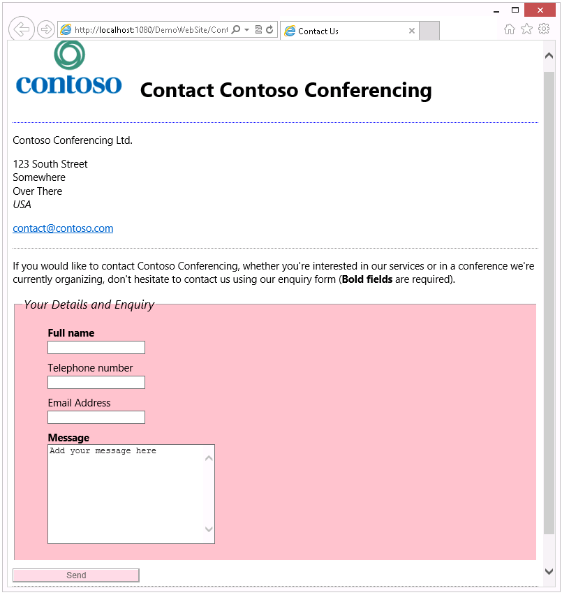

# Module 2: Creating and Styling HTML Pages

# Lesson 1: Creating an HTML5 Page

### Demonstration: Using HTML5 Features in a Simple Contact Form

#### Preparation Steps 

1. Ensure that you have cloned the 20480C directory from GitHub. It contains the code segments for this course's labs and demos. https://github.com/MicrosoftLearning/20480-Programming-in-HTML5-with-JavaScript-and-CSS3/tree/get_started/Allfiles.

#### Demonstration Steps

#### Divide the Content for a Page into an Article with Sections

1.	On the Windows 10 **Start** screen, click the **Visual Studio 2017** tile.
2.	In Visual Studio, on the **File** menu, point to **Open**, and then click **Project/Solution**.
3.	In the **Open Project** dialog box, browse to the **Allfiles\Mod02\Democode\Starter** folder, click **DemoWebSite.sln** and then click **Open**.
4.	In Solution Explorer, expand the **Allfiles\\...\\DemoWebSite** web application, and then double-click **ContactUs.html**.
5.	In the **ContactUs.html** file, enclose the entire contents of the **&lt;body&gt;** element in an **&lt;article&gt;** element as shown in bold in the following code example:
    ```html
        <!DOCTYPE HTML>
        <html lang="en">  
          ...
          </head>
          <body>
            <article>
            ...
            </article>
          </body>
        </html>

    ```
6.	Within the **&lt;article&gt;** element, enclose the first three **&lt;p&gt;** elements containing the company name, address, and contact email in a **&lt;section&gt;** element, as shown in bold in the following code example:
    ```html
        ...
        <h1>Contact Contoso Conferencing</h1>
          <section>
            <p>Contoso Conferencing Ltd.</p>
            <p>123 South Street<br />
            Somewhere<br />
            Over There<br />
            <em>USA</em></p>
            <p>
              <a href="mailto:contact@contoso.com">contact@contoso.com</a>
            </p>
          </section>
        <p>
        If you would like to contact Contoso Conferencing ...
        </p>
        ...
    ```
7.	Wrap the HTML form and **&lt;p&gt;** element immediately above it in a second **&lt;section&gt;** element, as shown in bold in the following code example:
    ```html
        ...
        <section>
          <p>
          If you would like to contact Contoso Conferencing ...
          </p>
          <form method="POST" action="support.aspx">
            ...
          </form>
        </section>
        ...
    ```
8.	On the **File** menu, click **Save All**.

#### Add a Header and a Footer to the Page

1.	Enclose the **&lt;h1&gt;** element near the top of the **ContactUs.html** file in a **&lt;header&gt;** element, as shown in bold in the following code example:
    ```html
        ...
        <article>
          <header>
            <h1>Contact Contoso Conferencing</h1>
          </header>
          ...
        </article>
        ...
    ```
2.	Add the following **&lt;img&gt;* element shown in bold to the **&lt;header&gt;** element above the **&lt;h1&gt;** element.
    ```html
        <header>
          
          <h1>Contact Contoso Conferencing</h1>
        </header>
    ```
3.	Add the following HTML markup shown in bold immediately after the **&lt;/article&gt;** tag near the end of the document.
    ```html
        ...
        </article>
        <footer>
          <p>
            <small>
              Last updated 
              <time datetime="2012-08">
                August 2012
              </time>
            </small>
          </p>
        </footer>
      </body>
    </html>
    ```
4.	On the **File** menu, click **Save All**.

#### View the Structure of the Page by Using the F12 Developer Tools

1.	On the **Debug** menu, click **Start Without Debugging**.
2.	In Microsoft Edge, if the message **Intranet settings are turned off by default** appears, click **Don’t show this message again**.
3.	Press F12.
4.	In the **F12** window, click the **HTML** tab.
5.	Expand the **&lt;html&gt;** element.
6.	Expand the **&lt;body&gt;** element.
7.	Expand the **&lt;article&gt;** element and verify that it contains a **&lt;header&gt;** element and two **&lt;section&gt;** elements.
8.	Expand the **&lt;header&gt;** element.
9.	Expand the **&lt;h1&gt;** element.
10.	Click each element, and verify that Microsoft Edge surrounds each element on the page with a box as it is selected in the **F12** window.


#### Make a Temporary Change to the Page by Using the F12 Developer Tools

1.	In the **&lt;h1&gt;** element, click **Contact Contoso Conferencing**.
2.	Change this text to **We'd love to hear from you…**, and then press ENTER.
3.	Verify that Microsoft Edge displays the modified text.
4.	Press F12 to close the **F12** window.
5.	Close Microsoft Edge, and then close Visual Studio 2017.

# Lesson 2: Styling an HTML5 Page

### Demonstration: Adding CSS Styles to an HTML Page

#### Preparation Steps 

1. Ensure that you have cloned the 20480C directory from GitHub. It contains the code segments for this course's labs and demos. https://github.com/MicrosoftLearning/20480-Programming-in-HTML5-with-JavaScript-and-CSS3/tree/get_started/Allfiles.

#### Demonstration Steps

#### Create New Styles by Using Visual Studio

1.	On the Windows 10 **Start** screen, click the **Visual Studio 2017** tile.
2.	In Visual Studio, on the **File** menu, point to **Open**, and then click **Project/Solution**.
3.	In the **Open Project** dialog box, browse to the **Allfiles\Mod02\Democode\Starter** folder, click **DemoWebSite.sln**, and then click **Open**.
4.	In Solution Explorer, expand the **Allfiles\\...\\DemoWebSite** web application, and then expand the **styles** folder.
5.	Double-click **ContactUsStyles.css**
6.	Review the existing rules for the **body** and **h1** elements.
7.	Modify the **body** rule, remove the color rule, and change the font used on the whole page as shown in bold in the following code example.
    ```css
        body {
          font-family: "Segoe UI", Helvetica, Arial, sans-serif;
        }
    ```
8.	Remove the following rule from the stylesheet:
    ```css
        h1 {
          font-family: 'Copperplate Gothic';
          color: red;
        }
    ```
9.	Add the following rules that make the header appear separately from the rest of the content.
    ```css
        header {
          padding-bottom: 10px;
          border-bottom: 2px dotted blue;
          margin-bottom: 10px;
        }

        header h1 {
          margin-left: 20px;
          display: inline-block;
        }
    ```
10.	Add the following empty rule:
    ```css
        section {
        }
    ```
11.	Click after the opening curly brace for the section rule, and in the toolbar click the **Build Style** button.   

>**Note:** If the toolbar is not visible, right-click in the body of the section rule and then click **Build Style**.

12.	In the **Modify Style** dialog box, in the **Category** list, click **Box**.
13.	Clear the **padding: Same for all** check box, and in the **bottom** box, type **5**.
14.	In the **Category** list, click **Border**.
15.	Under **border-style**, clear the **Same for all** check box, and in the **bottom** list box, click **dotted**.
16.	Under **border-width**, clear the **Same for all** check box, and in the **bottom** box, type **1**.
17.	Under **border-color**, clear the **Same for all** check box, and in the **bottom** box, type **grey**.
18.	Click **OK**.
19.	Verify that the section rule now looks like this:
    ```css
        section {
          padding-bottom: 5px;
          border-bottom-style: dotted;
          border-bottom-width: 1px;
          border-bottom-color: grey;
        }
    ```
20.	Add the following rules to style the form and its elements.
    ```css
        fieldset {
          background-color: pink;
          margin-bottom: 10px;
        }

        legend {
          font-size: 1.2em;
          font-style: italic;
        }

        fieldset li {
          list-style: none;
          margin-bottom: 10px;
        }

        input[type="submit"] {
          background-color: pink;
          opacity: 0.6;
          width: 200px;
        }
    ```
21.	On the **File** menu, click **Save All**.

#### Use the F12 Developer Tools to Inspect Styles

1.	In Solution Explorer, double-click **ContactUs.html**.
2.	On the **Debug** menu, click **Start Without Debugging**.
3.	In Microsoft Edge, if the message **Intranet settings are turned off by default** appears, click **Don’t show this message again**.
4.	Verify that the new styles have been applied to the page.



5.	In Microsoft Edge, press F12.
6.	In the **F12** window, with the **HTML** tab selected, double-click the **&lt;html&gt;** element to expand it.
7.	Click the **&lt;body&gt;** element.
8.	In the right pane, verify that the following the CSS rule appears:
    ```css
        font-family: "Segoe UI", Helvetica, Arial, sans-serif;
    ```
9.	In this rule, select the text **"Segoe UI"**.
10.	Change the value to read **"Times New Roman"** and press ENTER.
11.	Verify that Microsoft Edge reflects this change to the font on the page.
12.	In the left pane, expand the **&lt;body&gt;** element, expand the **&lt;article&gt;** element, and then click the first **&lt;section&gt;** element.
13.	In the right pane, verify that the following styles are specified for this section:
    ```css
        inherited – body
          body
            font-family: "Times New Roman", Helvetica, Arial, sans-serif;
        section 
          padding-bottom: 5px;
          border-bottom-color: grey;
          border-bottom-width: 1px;
          border-bottom-style: dotted;
    ```
14.	Press F12 to close the **F12** window.
15.	Close Microsoft Edge, and then close Visual Studio 2017.

### Demonstration: Creating and Styling an HTML5 Page

#### Preparation Steps 

1. Ensure that you have cloned the 20480C directory from GitHub. It contains the code segments for this course's labs and demos. https://github.com/MicrosoftLearning/20480-Programming-in-HTML5-with-JavaScript-and-CSS3/tree/get_started/Allfiles.
2. Navigate to **Allfiles/Mod01/Democode**, and then open the **DemoWebSite - Complete.sln** file.
3. Run the **DemoWebSite - Complete.sln** application.
4. In the Address bar of the Microsoft Edge window, note the port number that appears after "http://localhost:" You will use the port number during this demonstration.
5. Close the Microsoft Edge window.

©2018 Microsoft Corporation. All rights reserved.

The text in this document is available under the  [Creative Commons Attribution 3.0 License](https://creativecommons.org/licenses/by/3.0/legalcode), additional terms may apply. All other content contained in this document (including, without limitation, trademarks, logos, images, etc.) are  **not**  included within the Creative Commons license grant. This document does not provide you with any legal rights to any intellectual property in any Microsoft product. You may copy and use this document for your internal, reference purposes.

This document is provided &quot;as-is.&quot; Information and views expressed in this document, including URL and other Internet Web site references, may change without notice. You bear the risk of using it. Some examples are for illustration only and are fictitious. No real association is intended or inferred. Microsoft makes no warranties, express or implied, with respect to the information provided here.
