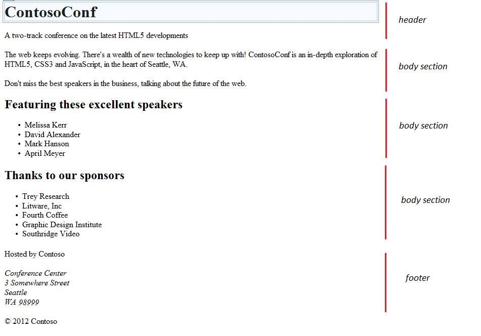
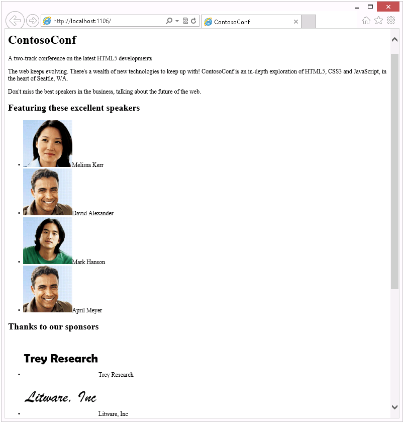
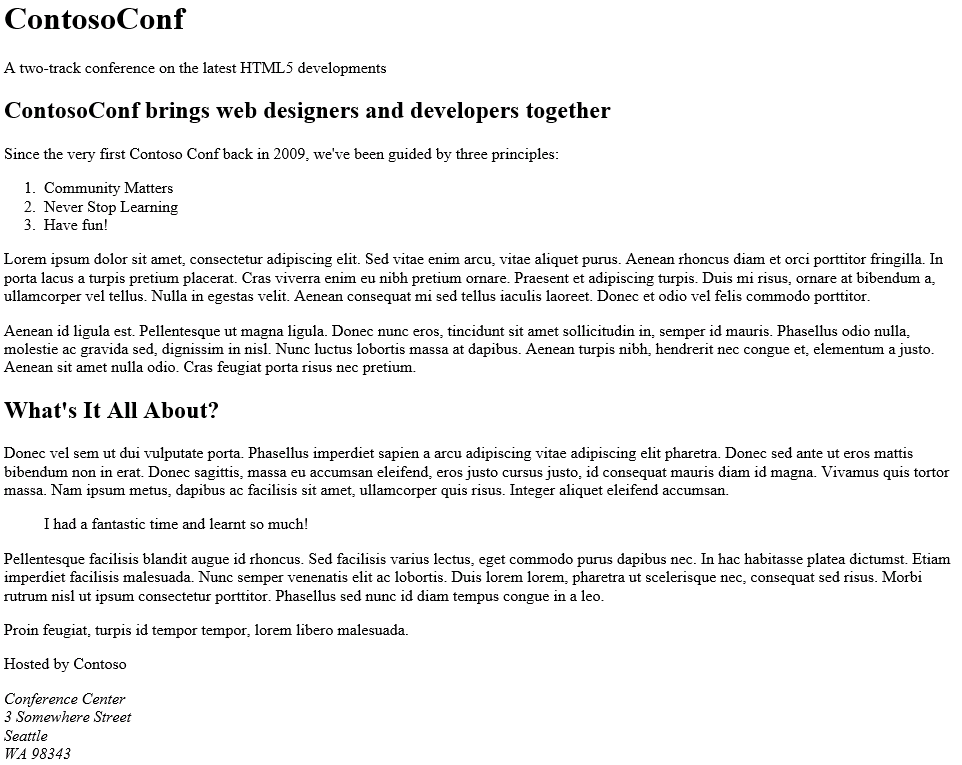
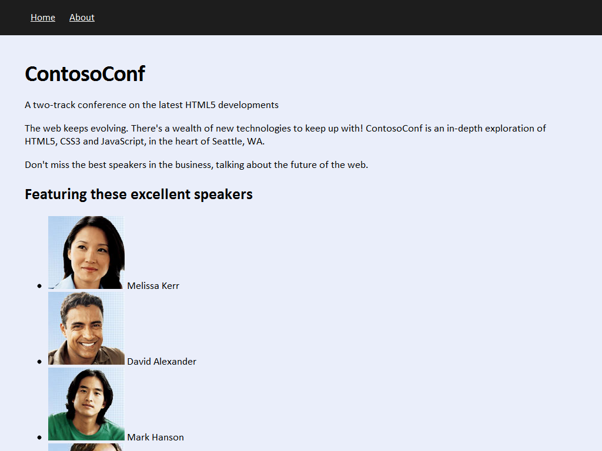
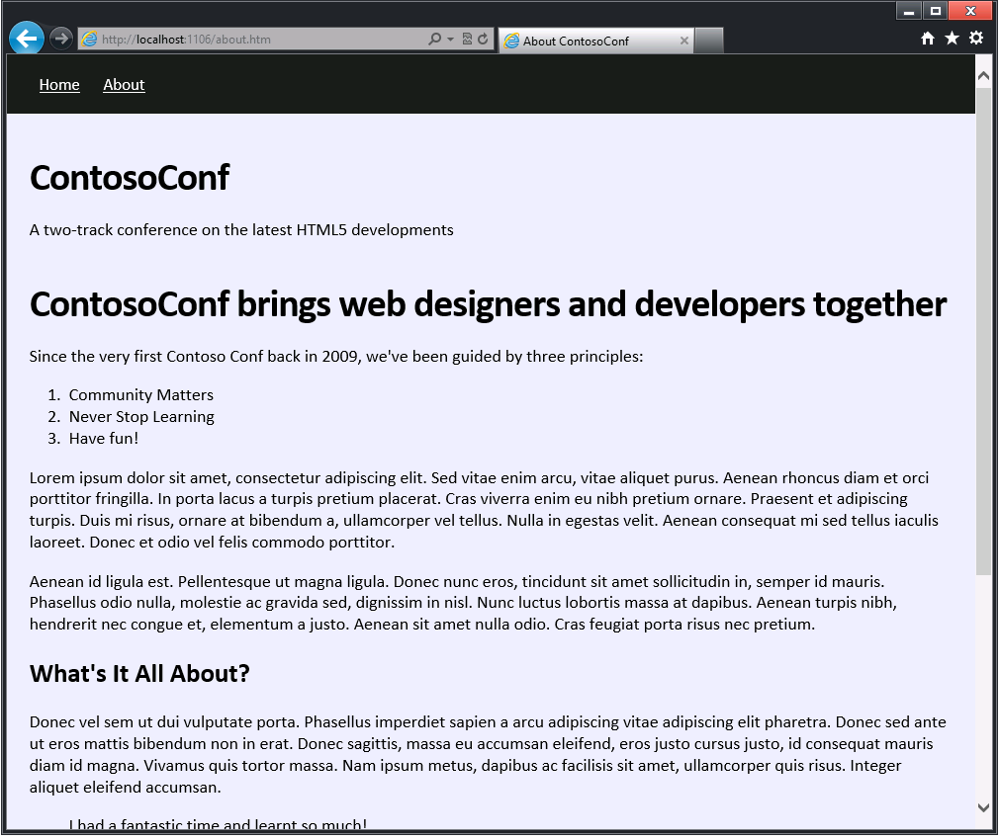

## Module 2: Creating and Styling HTML5 Pages
Wherever a path to a file starts with *[Repository Root]*, replace it with the absolute path to the folder in which the 20480 repository resides. For example, if you cloned or extracted the 20480 repository to **C:\Users\John Doe\Downloads\20480**, change the path: **[Repository Root]\AllFiles\20480C\Mod01** to **C:\Users\John Doe\Downloads\20480\AllFiles\20480C\Mod01**.

## Lab: Creating and Styling HTML5 Pages

#### Scenario

You are a web developer working for an organization that builds websites to support conferences. You have been asked to create a website for ContosoConf, a conference that showcases the latest tools and techniques for building HTML5 web applications. 

You decide to start by building a prototype website consisting of a **Home** page that acts as a landing page for conference attendees, and an **About** page that describes the purpose of the conference. In later labs, you will enhance these pages and add pages that allow attendees to register for the conference and provide information about the conference sessions. 

#### Objectives

After completing this lab, you will be able to:
- Create HTML5 pages.
- Style HTML5 elements.

#### Lab Setup

Estimated Time: **45 minutes**

### Exercise 1: Creating HTML5 Pages

#### Scenario
In this exercise, you will begin to create the ContosoConf website.

First, you will create a new ASP.NET Web Application. Then you will add two HTML files for the **Home** and **About** pages. Next, you will add navigation links to the pages. Finally, you will run the web application and verify that the **Home** page and the **About** page are formatted correctly.

#### Task 1: Create a new ASP.NET web application

1.	Start Microsoft Visual Studio 2017.
2.	In the **[Repository Root]\Allfiles\Mod02\Labfiles\Starter\Exercise 1** folder, create a new web application, and then name it **ContosoConf**. Use the **Visual C# ASP.NET Empty Web Application** template to create this web application. 

#### Task 2: Add the Home page

1.	Add a new HTML page, **index.htm**, to the ContosoConf project. This page is the default page for the website, and will be displayed when a user browses to the URL for the website.
2.	From the **[Repository Root]\Allfiles\Mod02\Labfiles\Starter\Exercise 1\Resources** folder, open the **index.txt** file in Notepad. 
3. Examine this file and add HTML5 elements to the **index.htm** file by using a web application that can display the items specified in the **index.txt** file. 
4. Use HTML5 elements such as **&lt;header&gt;**, **&lt;section&gt;**, and **&lt;footer&gt;** where appropriate. For example, the following **&lt;header&gt;** element has the content from the **index.txt** file:
 ```html
    <header>
        <h1>ContosoConf</h1>
        <p>A two-track conference on the latest HTML5 developments</p>
    </header>
 ```



#### Task 3: Add images to the Home Page

1.	Add the speaker and sponsor images to the ContosoConf project. You can find these images in the **[Repository Root]\Allfiles\Mod02\Labfiles\Starter\Exercise 1\Resources** folder. Add the images to a new folder, **images**, in the project.
2.	To include the images from the **speakers** and **sponsors** folders, which are located in the **images** folder, update the HTML markup in the **index.htm** file. For example:
    ```html
        
        Melissa Kerr
    ```



>**Note**: In an **&lt;img&gt;** element, you can use the **Pick URL** wizard to specify the **src** attribute for an image.

#### Task 4: Add the About page

1.	Add a new HTML page, **about.htm**, to the ContosoConf project.
2. On the **Project** menu, click **Add New Item**.
3. Select the **HTML Page** template.
4.	Add HTML elements to **about.htm** by using the text provided in the **about.txt** file, which is located in the **[Repository Root]\Allfiles\Mod02\Labfiles\Starter\Exercise 1\Resources** folder.
5. Add an appropriate title to the page.
6. From **index.htm**, copy the **&lt;header&gt;** and **&lt;footer&gt;** elements.
7. Use the **&lt;article&gt;**, **&lt;blockquote&gt;**, and **&lt;ol&gt;** elements where appropriate.



#### Task 5: Add navigation links

Add a navigation element to **index.htm** and **about.htm**. The navigation element should contain links to both pages. For example, the **&lt;nav&gt;** element for  **index.htm** should look like the following:
  ```html
      <nav>
          <a href="/index.htm">Home</a>
          <a href="/about.htm">About</a>
      </nav>
  ```

#### Task 6: Run the web application

1.	Run the web application by using Microsoft Edge.
2.	Verify that the correct text and images are displayed.
3.	Verify that the navigation links reference the correct pages.

>**Results**: After completing this exercise, you will have built a simple HTML5 web application with a **Home** page and an **About** page.

### Exercise 2: Styling HTML pages

#### Scenario

In this exercise, you will add styling to the **Home** and **About** pages.

You will create a stylesheet in the ContosoConf project. Then you will add CSS rules to style the **Home** and **About** pages to match a specified design. Finally, you will run the web application and verify that the pages are styled correctly.

#### Task 1: Create a new style sheet

1.	To the ContosoConf project, add a new folder, **styles**.
2.	To the **styles** folder, add a stylesheet, **site.css**.
3. On the **Project** menu, click **Add New Item**.
4. Select the **Style Sheet** template.
5. On the **index.htm** and **about.htm** files, add a link to the **site.css** style sheet.
6. Use a **&lt;link&gt;** element inside the page header; set the **href** property to **"styles/site.css"**, set the **rel** property to **"stylesheet"**, and then set the **type** property to **"text/css"**.

#### Task 2: Add CSS rules to style the pages

1.	To style the **&lt;html&gt;** element of the **Home** and **About** pages, add a CSS rule to the **site.css** style sheet (the same styling rules should apply to both pages):
- Set **background-color** property for the webpage to **#EAEEFA**, set the list of fonts in the font family to **Calibri**, **Arial**, **sans-serif**, and then set the font size **62.5%**.
2.	To style the **&lt;body&gt;** element of a webpage, add a CSS rule:
- Set the **margin** property to **0** and the **font-size** property to **1.8rem**.
3.	To style the **&lt;nav&gt;** element of a webpage, add a CSS rule:
- Set the **background-color** property to **#1d1d1d**, set the **line-height** property to **6rem**, and then set the **font-size** property to **1.7rem**.
- Additionally, add a style for all the links (**&lt;a&gt;** elements) inside a **&lt;nav&gt;** element; set the color property to **#fff** and the **padding** property to **1rem**.

>**Note**: Use the expression **nav a** to specify an **&lt;a&gt;** element inside a **&lt;nav&gt;** element in a CSS selector.

4.	To style the **&lt;h1&gt;** element of a webpage, add a CSS rule: 
- Set the **font-size** property to **4rem**, set the **letter-spacing** property to **-1px**, and then set the **margin** property to **1em 0 0,25em 0**.
5.	To modify the HTML markup for the **Home** and **About** pages and wrap the **&lt;a&gt;** elements in the **&lt;nav&gt;** section in **&lt;div class="container"&gt;** element, enter the following code:
    ```html
        <div class="container">
            <a href="/index.htm">Home</a>
            <a href="/about.htm">About</a>
        </div>
    ```
6.	To achieve the horizontally centered, fixed-width column effect for all sections marked with the container class, add a CSS rule to the **site.css** style sheet:
- Set the **padding** property to **0.1rem**, set the **max-width** property to **94rem**, and then set the **margin** property to **0 auto**.

>**Note**: Use the expression **.container** as the selector for the CSS rule.



>**Note**: Use the Microsoft Edge F12 developer tools to experiment with the CSS rules until you achieve the correct styling.


#### Task 3: Run the web application

Run the web application, and then verify that the **Home** and **About** pages are correctly styled.



Close Microsoft edge and close all open windows.

>**Result**: After completing this exercise, you will have used CSS rules to style the **Home** and **About** pages.

©2018 Microsoft Corporation. All rights reserved.

The text in this document is available under the [Creative Commons Attribution 3.0 License](https://creativecommons.org/licenses/by/3.0/legalcode), additional terms may apply. All other content contained in this document (including, without limitation, trademarks, logos, images, etc.) are **not** included within the Creative Commons license grant. This document does not provide you with any legal rights to any intellectual property in any Microsoft product. You may copy and use this document for your internal, reference purposes.

This document is provided &quot;as-is.&quot; Information and views expressed in this document, including URL and other Internet Web site references, may change without notice. You bear the risk of using it. Some examples are for illustration only and are fictitious. No real association is intended or inferred. Microsoft makes no warranties, express or implied, with respect to the information provided here.
