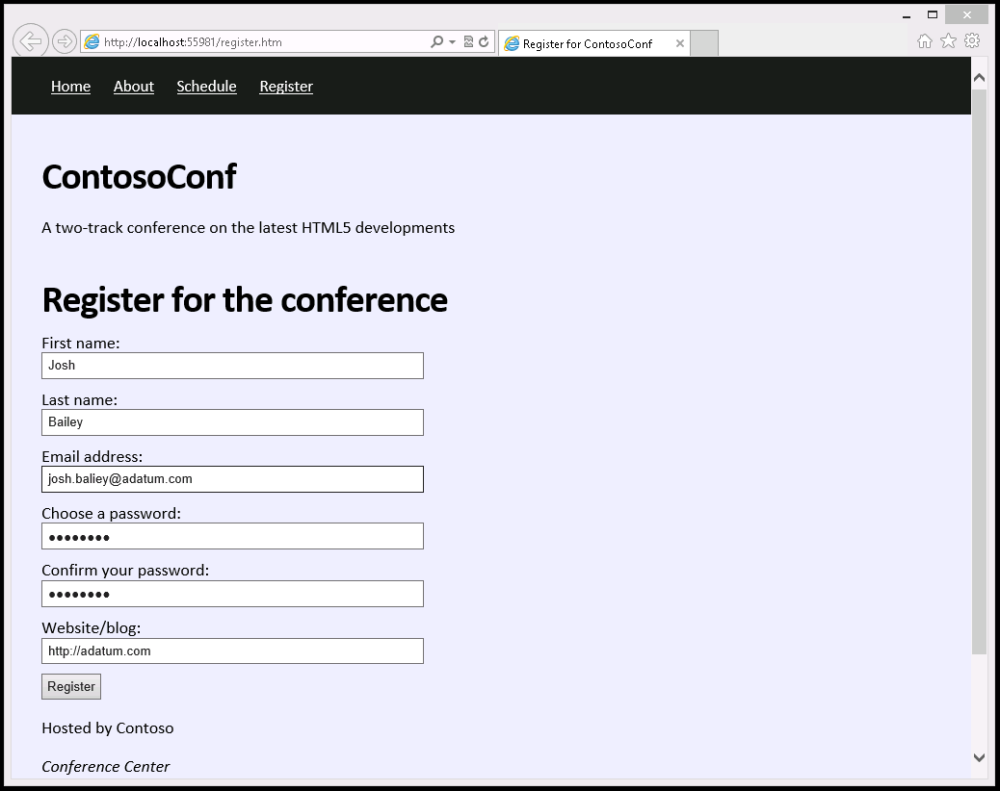
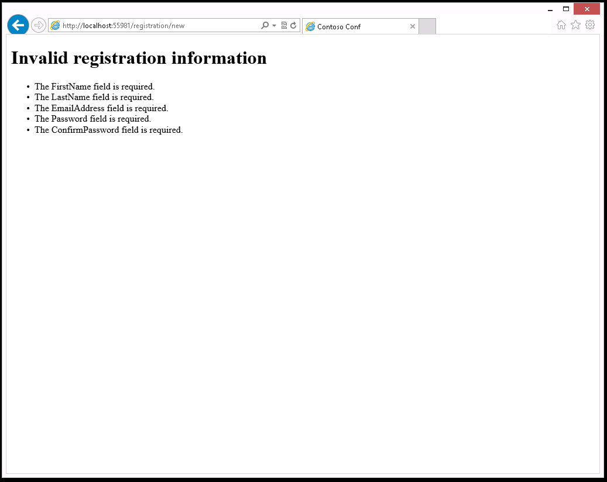
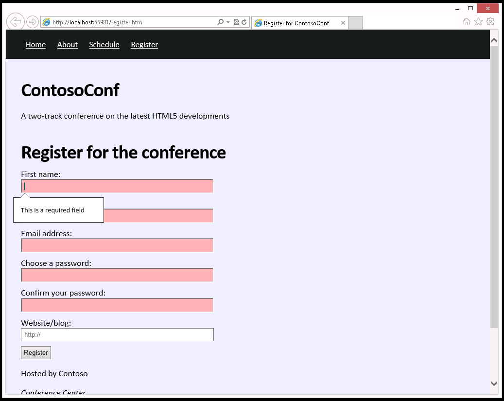

## Module 4: Creating Forms to Collect and Validate User Input

Wherever a path to a file starts with *[Repository Root]*, replace it with the absolute path to the folder in which the 20480 repository resides. For example, if you cloned or extracted the 20480 repository to **C:\Users\John Doe\Downloads\20480**, change the path: **[Repository Root]\AllFiles\20480C\Mod01** to **C:\Users\John Doe\Downloads\20480\AllFiles\20480C\Mod01**.

## Lab: Creating a Form and Validating User Input

#### Scenario

The delegates who want to attend ContosoConf will need to register and provide their details. You have been asked to add a page to the ContosoConf website that implements an attendee registration form.

The server-side code already exists to process the attendee data. However, the registration page performs minimal validation and is not user-friendly. You have decided to add client-side validation to the form to improve the accuracy of the registration data entered by attendees and to provide a better user experience.

#### Objectives

After completing this lab, you will be able to:
- Create a form by using HTML5 input elements and validate form data by using HTML5 attributes.
- Implement extended data validation by using JavaScript.

#### Lab Setup

Estimated Time: **60 minutes**

### Exercise 1: Creating a Form and Validating User Input by Using HTML5 Attributes

#### Scenario

In this exercise, you will create an HTML form that collects conference attendee registration information.

You will select the correct input types for each piece of data collected by the form. You will then enhance the input with additional attributes to improve the user experience and to add validation. For example, the first input item should automatically receive the focus when a page loads. Also, most of the input items are mandatory, the password must be sufficiently complex to improve security, and the form must prevent the submission of incomplete or invalid data. Finally, you will run the application, view the **Register** page, and then verify that form validation happens correctly.

#### Task 1: Modify the Register page

1.	Start Microsoft Visual Studio. From the **[Repository Root]\Allfiles\Mod04\Labfiles\Starter\Exercise 1** folder, open the **ContosoConf.sln** solution.
2.	Open the **register.htm** file. 
3.	Find the **&lt;form&gt;** element and read the **TODO** comment that describes the form input requirements together with the HTML snippet to use as a template:
   ```html
        <form method="post" action="/registration/new" id="registration-form">
            <!--
                TODO: Add form inputs

                FirstName - required string
                LastName - required string
                EmailAddress - required email address
                Password - required password string, at least 5 letters and numbers
                ConfirmPassword
                WebsiteUrl - optional url string
            -->

            <!-- Use the following template for the inputs -->
            <div class="field">
                <label for="{input-id}">label:</label>
                <input type="{type}" id="{input-id}" name="{input-name}" />
            </div>

            <div>
                <button type="submit">Register</button>
            </div>
        </form>
   ```
4.	Notice that **register.htm** has a reference to the **/styles/pages/register.css** style sheet in the **&lt;head&gt;** element **/scripts/pages/register.js** just before the **&lt;/body&gt;** tag:
   ```html
        <link href="/styles/pages/register.css" rel="stylesheet" type="text/css" />
   ```
This CSS file contains the styles for the registration page.
5.	Also notice that the **register.htm** file contains a reference to the **/scripts/pages/register.js** JavaScript file that contains the code used by the registration page:
  ```html
      <script src="/scripts/pages/register.js" type="text/javascript"></script>
  ```

#### Task 2: Add form inputs to the **Register** page

1.	Add the input elements specified by the **TODO** comment to the registration form:
- Do not include any validation yet.
- Use the most appropriate HTML5 input types. 
- Use the **&lt;div class="field"&gt;** template when creating the form inputs; provide a label for each input and remove this template when you have added all the inputs.
2.	Run the application, view the **register.htm** page, and then test the form with some valid data. The following image shows some suggested valid data values that you can use (use the text **Passw0rd** for the password).



3.	After you have entered a complete set of valid data, click **Register**. Verify that the **Thanks for registering page** appears.
4.	Return to the **Register** page. Notice that to start registering another attendee, you have to explicitly click to put the cursor in the **First name** box. 

Also, notice that you can leave boxes blank, or enter mismatching passwords. 

5.	Click **Register** again. 



It would be more efficient to trap these issues before the data is transferred to the server.

6.	Close Microsoft Edge.

#### Task 3: Make the form more user-friendly

1.	In the **register.htm** file, modify the **FirstName** input so that it automatically gets the focus when the browser loads the register page.
- Use the **autofocus** attribute.
2.	Modify the **Website** input to display the placeholder text **http://** when the page is displayed.
- Use the **placeholder** attribute.
3.	Run the application, view the **register.htm** page, verify that the **First name** box has focus and that the **Website** box contains the placeholder text.
4.	Close Microsoft Edge.

#### Task 4: Check for missing mandatory data

1.	In the **register.htm** file, add **required** attributes to the mandatory form inputs (**FirstName**, **LastName**, **EmailAddress**, **Password**, **ConfirmPassword**).
- Use the **required** attribute.

>**Note:** The password validation performed by the registration server requires that the password contains letters and numbers only. it does not allow punctuation and other characters.

2.	Run the application, view the **register.htm** page, and then click **Register** without entering any data.
3.	Try entering different combinations of boxes, and verify that the form cannot be submitted if any mandatory box is empty.


4.	Enter the complete details for an attendee, and then click **Register**. Verify that the form still enables the user to submit valid data.

#### Task 5: Add password complexity validation

1.	In the **register.htm** file, modify the **Password** input to ensure that the entered value is at least five characters long, and consists only letters and numbers.
- Use a pattern attribute with the following regular expression:
   ```html
        [a-zA-Z0-9]{5,}
   ```
- If the value in **Password** does not match the regular expression, display the following message by using the **title** attribute: 
   ```html
        At least 5 characters
   ```
2.	Run the application, open the **register.htm** page, register as an attendee, and verify that the value in the **Choose your password** box displays the error message for invalid password entries.
- Try a short password, such as **abc**
3.	Verify that the application accepts passwords that have at least five characters of which at least one is a letter and one is a number.
- Try a longer password such as **password** (this should work)
- Also, try a password with at least one numeric character, such as **Passw0rd** (this should also work)

>**Results:** After completing this exercise, you will have modified the attendee registration page to validate the data entered by attendees.

### Exercise 2: Validating User Input by Using JavaScript

#### Scenario

The conference registration form requires that the values in the **Choose a password** and **Confirm your password** boxes match. You cannot implement this type of validation by using HTML5 attributes. In this exercise, you will extend the registration form validation by using JavaScript. In addition, you will write the code to style any input that is not valid to attract the user’s attention.

You will implement a function to compare the two passwords and display an error message when the passwords do not match. Then you will add input event listeners for the password inputs, which call the password comparison function. You will test this feature to ensure that a user cannot submit a form with passwords that do not match.

Next, you will add a CSS style to highlight input elements that are not valid (some browsers such as Microsoft Edge already highlight them with a red border, but other browsers might not implement this feature by default). You will run the application, open the **Register** page, and then verify that the application highlights the invalid elements.

#### Task 1: Write code to get the contents of the password input elements

1.	In ContosoConf - Microsoft Visual Studio, from the **[Repository Root]\Allfiles\Mod04\Labfiles\Starter\Exercise 2** folder, open the **ContosoConf.sln** solution. This project contains a working version of the application as it should appear at the end of exercise 1, together with additional comments and code fragments used in this exercise.
2.	In the **ContosoConf** project, open the **scripts\pages\register.js** file and find the following comment: 
   ```javascript
        // TODO: Task 1 - Get the password <input> elements from the DOM by ID
   ```
3.	Create variables named **passwordInput** and **confirmPasswordInput** that contain references to the password boxes on the form. 
- Use the **getElementById** function.
- The **id** attributes of the password **&lt;input&gt;** elements are **password** and **confirm-password**

#### Task 2: Write code to compare the Choose you password and Confirm your password inputs

1.	The **register.js** file contains a function called **checkPasswords** that will examine whether the values in the **Choose your password** and **Confirm your password** boxes contain the same text. This function is currently empty (apart from some comments). 

In the **scripts\pages\register.js** file, find the following comment: 
   ```javascript
       // TODO: Task 2 - Compare passwordInput value to confirmPasswordInput value
   ```

2.	Add a statement that tests whether the two password inputs have the same value, and then store the Boolean result in a variable named **passwordsMatch**.
- Use the **value** property of the **passwordInput** and **confirmPasswordInput** variables to read the data that the user has entered into the password boxes on the form.
- Compare the value by using the === operator.

#### Task 3: Write code to display a custom error message if the passwords differ

1.	In the **comparePasswords** function, find the comment that starts with the following text:
   ```javascript
        // TODO: Task 3
   ```
2.	Add the code that uses the **setCustomValidity** method of the **confirmPasswordInput** variable to display an error message when the **passwordsMatch** variable indicates that the passwords do not match.

If the passwords match, clear the error message.

>**Note:** Setting a non-empty custom validity message will prevent the form from being submitted.

#### Task 4: Add input event listeners to the inputs to call the checkPasswords method

1.	When text is entered, the password input elements raise an event named **input**. 

In the **register.js** file, find the comment that starts with the following text:
   ```javascript
       // TODO: Task 4
   ```
2.	In the **passwordInput.addEventListener** function, add event listeners for this event to call the **checkPasswords** function.
- Use the **addEventListener** function.
3.	Run the application, view the **register.htm** page, enter valid data for the **First name**, **Last name**, and **Email address** boxes, and then verify that an error message appears when the data in the **Confirm your password** box does not match the data in the **Choose your password** box.
4.	Verify that the message does not appear if the passwords are the same.
5.	Close Microsoft Edge.

#### Task 5: Style elements that are invalid

1.	In the **ContosoConf** project, open the **styles\pages\register.css** file.
2.	At the end of the file, find the comment that starts with the following text:
   ```css
        /* TODO: Task 5
   ```
3.	Add a CSS rule that changes the background color of input elements that are invalid to **#f9b2b2**.
- The form has the **register** class, so only apply this styling to inputs that occur in this form (use the **.register** selector)
- Additionally, ensure that the CSS rule only applies when the **&lt;form&gt;** element has the **submission-attempted** class (concatenate **form.submission-attempted** to the selector)

>**Note:** The **formSubmissionAttempted** function adds the extra CSS class, which is called when **Register** is clicked, as shown in the following code from the register.js file:
>
>   ```javascript
>        var formSubmissionAttempted = function() {
>                form.classList.add("submission-attempted");
>        };
>
>        var addSubmitClickEventListener = function() {
>                submitButton.addEventListener("click", formSubmissionAttempted, false);
>        };
>    ```
>Initially, the required form inputs are empty and therefore invalid. However, the application should allow the user to complete the form before showing error messages.

- Finally, the styling should only be applied for invalid input, so concatenate the **input:invalid** pseudo-class to the end of the selector.
- Note that Microsoft Edge automatically adds a red outline to inputs that are invalid. Remove this default styling by setting the **outline** CSS property to **none**.
4.	Run the application, open the **register.htm** page, without entering any registration details, click **Register**. Verify that the application highlights the invalid inputs with colored backgrounds.



5.	Close Microsoft Edge.
6. Close all open windows.

>**Result:** After completing this exercise, you will have modified the registration page to validate password inputs.

©2018 Microsoft Corporation. All rights reserved.

The text in this document is available under the  [Creative Commons Attribution 3.0 License](https://creativecommons.org/licenses/by/3.0/legalcode), additional terms may apply. All other content contained in this document (including, without limitation, trademarks, logos, images, etc.) are  **not**  included within the Creative Commons license grant. This document does not provide you with any legal rights to any intellectual property in any Microsoft product. You may copy and use this document for your internal, reference purposes.

This document is provided &quot;as-is.&quot; Information and views expressed in this document, including URL and other Internet Web site references, may change without notice. You bear the risk of using it. Some examples are for illustration only and are fictitious. No real association is intended or inferred. Microsoft makes no warranties, express or implied, with respect to the information provided here.
