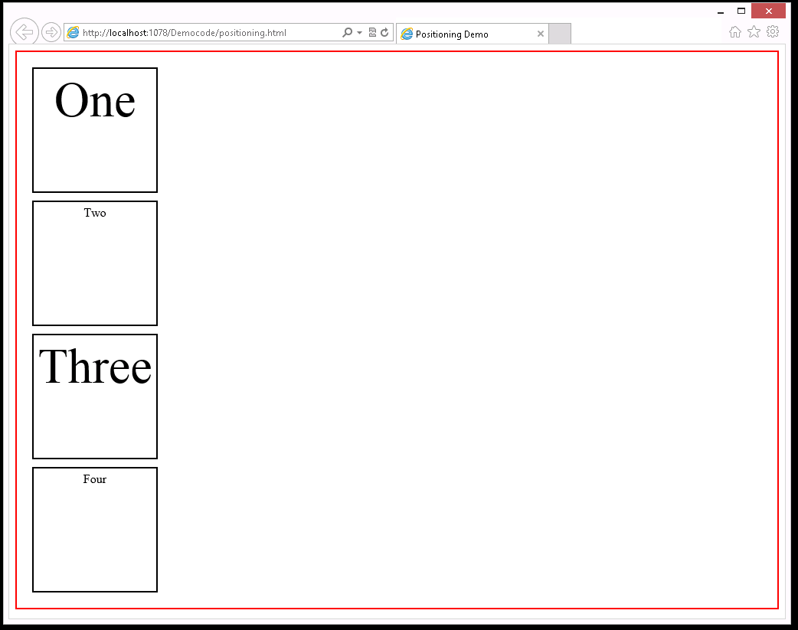
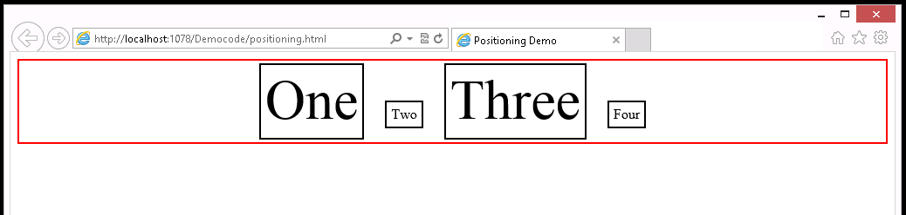
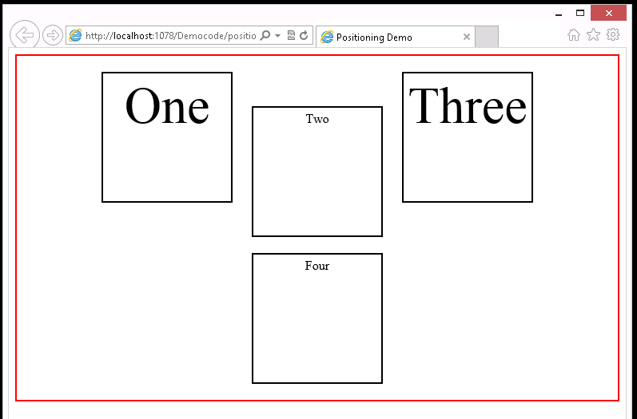

# Module 6: Styling HTML5 by Using CSS3

Wherever a path to a file starts with *[Repository Root]*, replace it with the absolute path to the folder in which the 20480 repository resides. For example, if you cloned or extracted the 20480 repository to **C:\Users\John Doe\Downloads\20480**, change the path: **[Repository Root]\AllFiles\20480C\Mod01** to **C:\Users\John Doe\Downloads\20480\AllFiles\20480C\Mod01**.

# Lesson 2: Styling Block Elements

### Demonstration: Switching Between Cascading Style Sheets (CSS) Layout Models

#### Preparation Steps 

Ensure that you have cloned the 20480C directory from GitHub (**https://github.com/MicrosoftLearning/20480-Programming-in-HTML5-with-JavaScript-and-CSS3/tree/master/Allfiles**). It contains the code segments for the labs and demos in this course.

#### Demonstration Steps

#### Switch between layout modes in a webpage

1.	Open Microsoft Visual Studio 2017.
2.	In Microsoft Visual Studio, on the **File** menu, point to **Open**, and then click **File**.
3.	In the **Open File** dialog box, browse to the **[Repository Root]\Allfiles\Mod06\Democode** folder, click **positioning.html**, and then click **Open**.
4.	Review the code with the students. This file contains an HTML **article** with four **div** elements. The file also contains styles for the **article** and **div** elements.
   ```html
        <!DOCTYPE html>
        <html xmlns="http://www.w3.org/1999/xhtml">
        <head>
          <title>Positioning Demo</title>
          <style type="text/css">
            body {
              text-align: center;
            }

            article {
              padding: 10px;
              border: 2px solid red;
            }

            div {
              margin: 10px;
              padding: 5px;
              border: 2px solid black;
              width: 150px;
              height : 150px;
            }

            div:nth-child(odd) {
              font-size: 4rem;
            }
          </style>
        </head>
        <body>
          <article>
            <div id="one">One</div>
            <div id="two">Two</div>
            <div id="three">Three</div>
            <div id="four">Four</div>
          </article>
        </body>
        </html>
   ```
5.	On the **File** menu, click **View in Brower (Microsoft Edge)**.
6.	In Microsoft Edge, if the **Intranet settings are turned off by default** message appears, click **Don’t show this message again**.
7.	Observe the four **div** elements laid out one below the other, in order, within the **article** element. To highlight its boundaries, the **article** element has a red border. This is the **block layout** mode.



8.	Press F12.
9. In the F12 Developer Tools Pane, click on **Dock Bottom** option on the top right corner, so that can see Both Microsoft Edge and Developer windows at the same time.
10.	To display the fully expanded version of the layout rules applied to the HTML content, click **Elements** tab.
11. In Elements tab expand **body** and expand **article**.
12.	Right-click the **div** entry, and then select **Add attribute**.
13.	Type **style=display: inline** for each **div** entry, and then press ENTER.
14.	In Microsoft Edge, notice that the four **div** elements are now laid out side-by-side aligned by text baseline with height and width properties ignored. This is the **inline layout** mode.



15.	Resize the browser window to make it narrower, so you can see how the application wraps the blocks onto the next line in the **inline layout** mode.
16.	In the F12 Developer Tools window, on the **CSS** tab, click the **display: inline** rule, change it to read **display:inline-block**, and then press ENTER.
17.	Notice the layout is the same but the **height** and **width** properties are now preserved. This is the **inline-block** mode. 

>**Note**: If required, make the browser window wider so that blocks **One** and **Three** are on the same line.



18.	In Microsoft Edge, resize the browser window so you can see how the application wraps the blocks onto the next line in the **inline layout** mode.
19.	In the F12 Developer Tools window, on the **CSS** tab, click the **display: inline-block** rule. Change this rule to **display:-ms-flexbox**, and then press ENTER.
20.	To view the new layout, switch to Microsoft Edge. The application displays the **div** elements in a vertical column.
21.	In the F12 Developer Tools window, on the **CSS** tab, click the **display: -ms-flexbox** rule, change it to **display:table-cell**, and then press ENTER.
22.	To view the new layout, switch to Microsoft Edge. The application displays the **div** elements in a horizontal table.

#### Switch between positioning modes in a webpage

1.	In the F12 Developer Tools window, on the **CSS** tab, clear the three check boxes next to the display attributes for **body**, **article**, and **div**.
2.	Right-click the **div** entry, and then select **Add rule**.
3.	Type **#three**, and then press **Tab**.

>**Note**: This action creates a new rule for the **&lt;div&gt;** element with the **id** property set to **three**. This is the **&lt;div&gt;** containing the text **Three**.

4.	Type **position: relative**, and then press ENTER.
5.	Right-click the **#three** entry, and then select **Add property**.
6.	Type **top: 2em**, and then press ENTER.
7.	Right-click the **#three** entry, and then select **Add property**.
8.	Type **left: 2em**, and then press ENTER.
9.	In Microsoft Edge, notice how the application positions the **three** box relative to its normal position.
10.	In the F12 Developer Tools window, on the **CSS** tab, click the **position:relative** rule for the **#three** selector, change it to **position:absolute**, and then press ENTER.
11.	In Microsoft Edge, notice how the application positions the**three** box relative to its containing **article** block.
12.	In the F12 Developer Tools window, on the **CSS** tab, click the **position:absolute** rule for the **#three** selector, change it to **position:fixed**, and then press ENTER.
13.	In Microsoft Edge, notice how the application positions the **three** box relative to the browser window. Make the window small enough to require scrolling and see how the **three** box remains stationary when you scroll (it does not scroll into view).
14.	Close Microsoft Edge.
15.  Close **positioning.html - Microsoft Visual Studio**. 

# Lesson 4: Enhancing Graphical Effects by Using CSS3

### Demonstration: Styling Text and Block Elements by Using CSS3

#### Preparation Steps 

Ensure that you have cloned the 20480C directory from GitHub (**https://github.com/MicrosoftLearning/20480-Programming-in-HTML5-with-JavaScript-and-CSS3/tree/master/Allfiles**). It contains the code segments for the labs and demos in this course. 

#### Demonstration Steps

1.	Read the lab scenario to the students and point out that they should read each scenario before attempting the lab for a module.
2.	Point out to students that the exercise scenario for each exercise is essential reading and contains a description of what they will accomplish in the exercise.
3.	Start Microsoft Visual Studio.
4. In Microsoft Visual Studio, on the File menu point to **Open**, and then click **Project/Solution**.
5. From the **[Repository Root]\Allfiles\Mod06\Labfiles\Solution\Exercise 3** folder, open the **ContosoConf.sln** solution.
>**Note**: If **Security Warning for ContosoConf** dialog box appears, clear **Ask me for every project in this solution** checkbox and then click **OK**.
6.	On the **Debug** menu, click **Start Without Debugging**.

>**Note**: If the **Intranet settings are turned off by default** message appears, click **Don’t show this message again**.

7.	In Microsoft Edge, on the **Home** page, point out the styling of the items in the navigation bar. Click each page in turn, and notice how the navigation bar uses a ribbon effect to indicate the current page.
8.	In the navigation bar, click **Home**.
9.	On the **Home** page, point out the **Register Free** link. This is an ordinary HTML link created as a **&lt;a&gt;** tag that takes the user to the **Register** page, but styled to look like a large red button.
10.	Place the mouse pointer over the **Register Free** link and point out how the link is highlighted.
11.	In the navigation bar, click **About**. Point out the following features of the text on this page:
   - The text is formatted in three columns.
   - The first letter of the first paragraph is styled as a drop cap.
   - The text at the start of all the remaining paragraphs is indented.
   - The block quote in the third column is styled to make it stand out.
12.	Close Microsoft Edge.
13.	In **Solution Explorer**, expand the **ContosoConf** project, expand the **styles** folder, and then double-click **nav.css**.
14.	In the **Code Editor** window, scroll through the code. Point out that to change the layout of the navigation bar, the students will add the styles defined in this file.
15.	In **Solution Explorer**, double-click **header.css**. 
16.	In the **Code Editor** window, summarize the purpose of the following style rules:
   - **header.page-header .register**. This rule formats the **Register Free** link as a large red button.
   - **header.page-header .register:hover**. This rule highlights the **Register Free** link when the mouse pointer is placed over it.
   - **header.page-header .register:before**. This rule adds a dotted border around the button for the **Register Free** link.
   - **header.page-header .register .free**. This rule sets the font size of the word **Free** in the **Register Free** link. This word is displayed with a font size that is 80% of the size of the word **Register**.
17.	In **Solution Explorer**, in the **styles** folder, expand **pages**, and then double-click **about.css**. 
18.	In the **Code Editor** window, summarize the purpose of the following style rules:
   - **.about > article > section**. This rule formats the text on the **About** page in three columns.
   - **.about p:first-child:first-letter**. This rule formats the first letter of the first paragraph as a drop cap.
   - **.about p**. This rule indents each paragraph on the **About** page.
   - **.about p:first-child**. This rule prevents the drop cap in the first paragraph from being indented.
   - **.about blockquote**. This rule formats the text for the block quote on the **About** page.
   - **.about blockquote:before**. This rule adds the quote mark to the start of the block quote.
19. Close all open windows.

©2018 Microsoft Corporation. All rights reserved.

The text in this document is available under the  [Creative Commons Attribution 3.0 License](https://creativecommons.org/licenses/by/3.0/legalcode), additional terms may apply. All other content contained in this document (including, without limitation, trademarks, logos, images, etc.) are  **not**  included within the Creative Commons license grant. This document does not provide you with any legal rights to any intellectual property in any Microsoft product. You may copy and use this document for your internal, reference purposes.

This document is provided &quot;as-is.&quot; Information and views expressed in this document, including URL and other Internet Web site references, may change without notice. You bear the risk of using it. Some examples are for illustration only and are fictitious. No real association is intended or inferred. Microsoft makes no warranties, express or implied, with respect to the information provided here.
