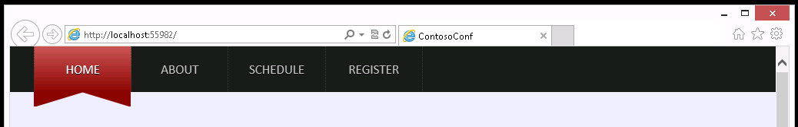
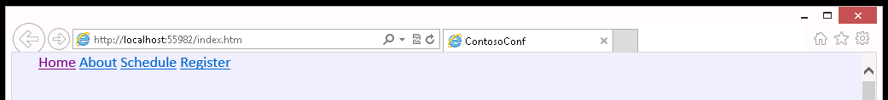
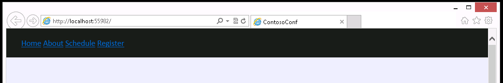
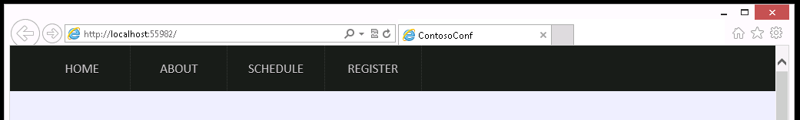
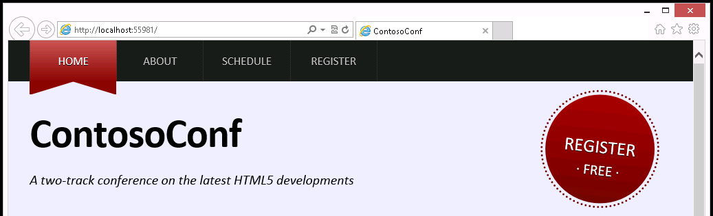
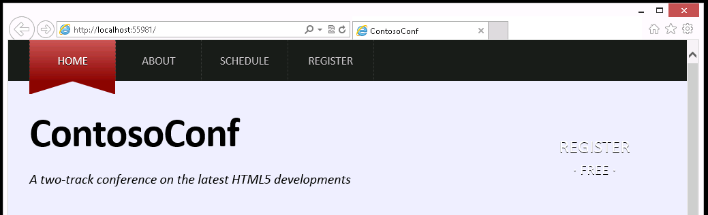
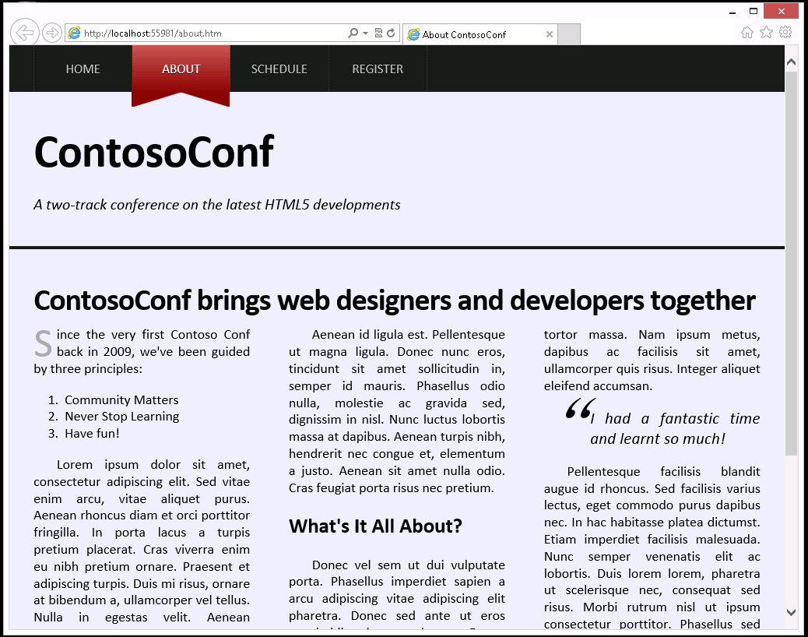
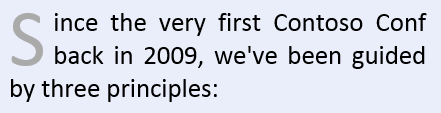
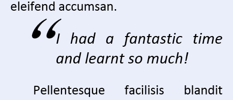

## Module 6: Styling HTML5 by Using CSS3

Wherever a path to a file starts with *[Repository Root]*, replace it with the absolute path to the folder in which the 20480 repository resides. For example, if you cloned or extracted the 20480 repository to **C:\Users\John Doe\Downloads\20480**, change the path: **[Repository Root]\AllFiles\20480C\Mod01** to **C:\Users\John Doe\Downloads\20480\AllFiles\20480C\Mod01**.

## Lab: Styling Text and Block Elements by Using CSS3

#### Scenario

The Contoso Conference web application needs to be visually appealing. A designer has produced mock-up designs of some of the pages that you have been asked to implement for the website.

You will be working on the **Home** and **About** pages. The HTML page structure has already been created. You will use Cascading Style Sheets (CSS) to style various parts of the pages, to make them match the designs. Much of the CSS that you create, such as the navigation links bar, will be reused by other pages.

Some aspects of the design are complicated and would have required images with previous versions of CSS. However, by using CSS3, you will not need to create any images.

#### Objectives

After completing this lab, you will be able to:
- Implement advanced styling for text elements by using CSS.
- Style block elements by using CSS.
- Create graphical elements by using CSS.

#### Lab Setup

Estimated Time: **60 minutes**

### Exercise 1: Styling the Navigation Bar

#### Scenario

In this exercise, you will style the navigation bar for the website.



The HTML markup for the navigation bar is simply a collection of **&lt;a&gt;** elements. The links are arranged as horizontally stacked blocks, which maximizes the click area. You will style the active page link with a linear gradient and red ribbon effect.

Finally, you will run the application, open the **Home** page, and then verify that the navigation bar looks similar to the image above.

>**Note**: The layout of the **Home** page has also changed slightly. The images of the speakers and the sponsor's logos have been laid out in a grid by using the **Flexible Box Model** display style.

#### Task 1: Review the HTML structure

1.	Start Microsoft Visual Studio.
2. From the **[Repository Root]\Allfiles\Mod06\Labfiles\Starter\Exercise 1** folder, open the **ContosoConf.sln** solution.
3.	In the **ContosoConf** project, open the **index.htm** file. Notice that the **&lt;head&gt;** has a link to the **/styles/nav.css** style sheet:
   ```html
        <link href="/styles/nav.css" rel="stylesheet" type="text/css" />
   ```
4.	At the start of the **&lt;body&gt;** find the **&lt;nav&gt;** element. Notice that the class of the **&lt;nav&gt;** element is **page-nav**, and that it contains a **&lt;div&gt;** element with the **container** class. Also notice that the **Home** link has class set to **active** because it is the active page:
   ```html
        <nav class="page-nav">
          <div class="container">
            <a href="/index.htm" class="active">Home</a>
   ```
5.	Run the application, open the **Home** page, and then notice that the navigation links are currently unstyled.



6.	Close Microsoft Edge. 

#### Task 2: Style the navigation bar and links

1.	From the **styles** folder, open the **nav.css** style sheet.
2.	Add styles for the navigation bar as follows: 
- Replace the __/* TODO: nav.page-nav  */__ comment with a rule that styles **nav** elements that have the **page-nav** class (**nav.page-nav**). Set the background color to **#1d1d1d**, set the line height to **6rem**, and then set the font size to **1.7rem**.
- Replace the __/* TODO: nav.page-nav .container */__ comment with a rule that styles elements that have the container class inside **nav.page-nav** elements (**nav.page-nav .container**). Style the container to use the **Flexible Box Layout** model.

>**Note**: Microsoft Edge requires you to use **-ms-flexbox**; note the **-ms-vendor** prefix.



3.	Replace the __/* TODO: nav.page-nav a */__ comment with a style for the links on the navigation bar by using the **nav.page-nav** as a selector, as follows:
- Set the display style to **block**.
- Set the minimum width to **9rem**.
- Set the top and bottom paddings to **0**, and the left and right paddings to **1.8rem**.
- Set the text alignment to **center**.
- Transform the text of all links to upper case.
- Set the link color to **#c3c3c3**.
- Add a **1px** dotted border to the right of each link and set the the border color to **#3d3d3d**.
- Add a small, black text shadow.
- Display the text for the links in uppercase.



4.	Replace the __/* TODO: nav.page-nav a:first-child */__ comment with a CSS rule that displays a **1px** dotted border with the color **#3d3d3d** to the left of the first link in the navigation bar. (Use the **first-child** pseudo-element to select the first link.)
5.	Replace the __/* TODO: nav.page-nav a:hover */__ comment with a CSS rule that applies when the mouse pointer is placed over a navigation link. Make the text color **#e4e4e4** and the background color **black**. (Use the **hover** pseudo-element.)
6.	Replace the __/* TODO: nav.page-nav .active */__ comment with a CSS rule for the active navigation link. Make the text color white and make the background a linear gradient from **#c95656** to **#8d0606**. 
7.	Replace the __/* TODO: nav.page-nav .active:hover */__ comment with a CSS rule that overrides the text color when the mouse pointer is placed over the active link. Make the text white.

#### Task 3: Create graphics by using pseudo elements

	Replace the __/* TODO: nav.page-nav active:before */__ and __/* TODO: nav.page-nav active:after */__ comments with two CSS rules by using the **:before** and **:after** pseudo elements that generate triangle shapes below the active link, to simulate a ribbon effect.
- Set the **display** property to **block**.
- You may need to experiment with the **position**, **top**, **height**, **width**, **border-top**, **border-left**, **border-right**, and **margin-left** properties until you achieve the correct effect.
- Set the color of the triangles to **#8d0606**.
   ```css
        .example:after {
            content: "";
            border-top: 100px solid #000;
            border-left: 100px solid transparent;
            display: block;
            position: absolute;
        }
   ```


#### Task 4: Test the navigation bar

1.	Run the application.
2. Open the **home.htm** page.
3. Verify that the navigation bar looks similar to the image shown in the previous task.
4.	Use the navigation bar to move between pages (for example, move to the **About** page), and then verify that the style of the active item in the navigation bar is displayed by using the ribbon effect.
5.	Close Microsoft Edge.


>**Results**: After completing this exercise, you will have styled the navigation bar to match the design mockup.

### Exercise 2: Styling the Register Link

#### Scenario

In this exercise, you will style the large **Register** link that appears in the header of the **Home** page. This link is unstyled, but you have been asked to make it stand out so that users will notice it.



You will use a style to set the position of the **Register** link. You will modify the appearance of the text for the link, add a background gradient, rotate the link, and then add the circular dotted border. Finally, you will run the application, open the **Home** page, and then verify that the **Register** link is similar to that envisioned by the designer.

#### Task 1: Review the HTML and CSS

1.	From the **[Repository Root]\Allfiles\Mod06\Labfiles\Starter\Exercise 2** folder, open the **Contoso.conf** solution.
2.	In the **ContosoConf** project, open the **index.htm** file.
3.	Notice that the **&lt;head&gt;** element contains a link to the **header.css** style sheet in the **styles** folder:
   ```html
        <link href="/styles/header.css" rel="stylesheet" type="text/css" />
   ```
4.	Find the **&lt;header&gt;** element and review the contents. Notice that the header contains the HTML markup for the **Register** link. Also notice that the class of the header is **page-header** and that the class of the **Register** link is **register**:
   ```html
        <header class="page-header">
            <div class="container">
                <h1>ContosoConf</h1>
                <p class="tag-line">A two-track conference on the latest HTML5      developments</p>

                <a class="register" href="/register.htm">
                    Register<br />
                    <span class="free">&#183; Free &#183;</span>                
                </a>
            </div>
        </header>
   ```
5.	Run the application.
6. Open the **index.htm** page.
7. Verify that the header’s **Register** link is not styled. 
8.	Close Microsoft Edge.

#### Task 2: Position the Register link and set the text styling

1.	From the **styles** folder, open the **header.css** file.
2.	Find the currently empty CSS rule for the **register** class of the page header after the __/* TODO: header.page-header .register */__ comment. In this rule, implement the following styling:
- Use the **block layout** model for the **Register** link and give it a height of **10rem** and a width of **16rem**. Set the **right** property to **3.5rem**, the **top** property to **2rem**, and the **padding-top** property to **6rem**.
- Position the **Register** link near the top-right of its container.
3.	Modify the **header.page-header .register** rule to set the **font-size**, **text-alignment**, **text-decoration**, and **text-transformation** properties for the **Register** link: 
- Make the text appear in upper case with a font size of **2.7rem**.
- Set the text color to white.
- Add a **1px** black text shadow.
- Set the text alignment to **center**.
- Do not apply any additional text decoration.



#### Task 3: Style the Register link background, shape, and rotation properties

1.	The **Register** link is currently quite difficult to see. Modify the **header.page-header .register** rule as follows:
- Add a linear gradient background to the **Register** link. Use the colors **#a80000** and **#740404** (use the **–ms-linear-gradient** function to set the **background** property).
- Set the **–ms-border-radius** property to make the **Register** link circular.
- Use the **–ms-transform** property to rotate the **Register** link six degrees clockwise.
2.	To change the background linear gradient colors to **#bc0101** and **#8c0909**, when the mouse pointer is placed over the link, implement the **header.page-header .register:hover** CSS rule. 
- Set the background property by using the **–ms-linear-gradient** function.
3.	Implement the **header.page-header .register:before** CSS rule to create a **3px** circular, dotted border around the **Register** link. Specify the border color as **#740404**.
- Set the **–ms-border-radius** property to create the circular effect.
- Make the border slightly wider and taller than the **Register** link (set the **height** and **width** properties to **16.8rem**).
- Adjust the position of the border to center it on the link (adjust the **top** and **right** properties by **-0.7rem**).

#### Task 4: Test the Register link

1.	Run the application.
2. Open the **index.htm** page:


3.	Verify that the **Register** link changes color when the mouse pointer is placed over it.
4.	Close Microsoft Edge.

>**Result**: After completing this exercise, you will have styled the **Register** link in the header of the **Home** page.

### Exercise 3: Styling the About Page

#### Scenario

In this exercise, you will style the **About** page. This page only contains text, but to make it look attractive you will use some advanced typography styling. 

First, you will the text flow over three columns and add a drop cap style to the first letter. Then, you will style a testimonial quote. Finally, you will run the application, open the **About** page, and then verify that it looks like the following image:



#### Task 1: Review the HTML and CSS

1.	From the **[Repository Root]\Allfiles\Mod06\Labfiles\Starter\Exercise 3** folder, open the **Contoso.conf** solution.
2.	In the **ContosoConf** project, open the **about.htm** file. 
3.	In the **&lt;head&gt;** element, in the **/styles/pages** folder, notice that there is a link to the **about.css** style sheet:
   ```html
        <link href="/styles/pages/about.css" rel="stylesheet" type="text/css" />
   ```
4.	Review the **&lt;article class="container"&gt;** HTML markup. This article contains the text that is displayed in the body of the **About** page. You will add styling to this markup:
   ```html
        <section class="page-section about">
            <article class="container">
                ...
            </article>
        </section>
   ```

#### Task 2: Define text columns

1.	Open the **about.css** file in the **styles/pages** folder.
2.	After the __/* TODO: **.about > article > section** */__ comment, implement the **.about > article > section** CSS rule as follows: 
- Flow the content over three columns.
- Add a gap of **5rem** between the columns.
- Justify the text.

#### Task 3: Add a drop cap at the start of the text

1.	In **about.css**, after the __/* TODO: Add drop cap styling */__ comment, add a CSS rule that makes the first letter of the first paragraph larger, as follows:
- Use the **first-letter** pseudo property to select the first letter of the text.
- Use the **font-size** property to make the first letter three times bigger than the rest of the text.
- To make the rest of the text wrap around the first letter, use the **float** property.
- Set the **color** property to **#aaa**.
- Experiment with the **margin** and **line-height** properties until the layout of the text matches the following image:



#### Task 4: Indent paragraphs

1.	In **about.css**, after the __/* TODO: Indent paragraphs */__ comment, add a CSS rule that uses the **text-indent** property to indent the first line of each paragraph by **3rem**.
2.	The first paragraph does not require indentation because it already has a drop cap effect; add a CSS rule specifically for the first paragraph (use the **.about p:first-child** selector), which resets the indentation and margin.

#### Task 5: Style the block quote

1.	In **about.css**, after the __/* TODO: Blockquote */__ comment, add CSS rules that style **blockquote** elements to look like the following image:



- Use the **.about blockquote** selector to create a rule that sets the **font-size (1.2em)**, **padding (0 0 0 6rem)**, **margin (0)**, **style (italic)** and position (**relative**) properties.
- Add another rule that uses the **:before** pseudo element to generate the large double quotation mark.
- Use the **'\201C'** sequence for the quotation mark, set the font size to **10rem** and the font family to **serif**.
- Set the **position** property to **absolute** and experiment with the values for the **top** and **line-height** properties.
- Ensure that the text appears with the appropriate spacing.

#### Task 6: Test the About page

1.	Run the application.
2. Open the **About** page.


3.	Close Microsoft Edge.
4. Close all open windows.

>**Result**: After completing this exercise, you will have styled the text on the **About** page.

©2018 Microsoft Corporation. All rights reserved.

The text in this document is available under the  [Creative Commons Attribution 3.0 License](https://creativecommons.org/licenses/by/3.0/legalcode), additional terms may apply. All other content contained in this document (including, without limitation, trademarks, logos, images, etc.) are  **not**  included within the Creative Commons license grant. This document does not provide you with any legal rights to any intellectual property in any Microsoft product. You may copy and use this document for your internal, reference purposes.

This document is provided &quot;as-is.&quot; Information and views expressed in this document, including URL and other Internet Web site references, may change without notice. You bear the risk of using it. Some examples are for illustration only and are fictitious. No real association is intended or inferred. Microsoft makes no warranties, express or implied, with respect to the information provided here.
