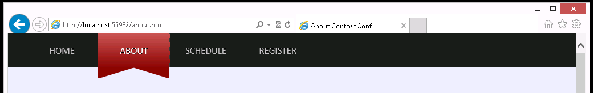

# Module 6: Styling HTML5 by Using CSS3

Wherever a path to a file starts with *[Repository Root]*, replace it with the absolute path to the folder in which the 20480 repository resides. For example, if you cloned or extracted the 20480 repository to **C:\Users\John Doe\Downloads\20480**, change the path: **[Repository Root]\AllFiles\20480C\Mod01** to **C:\Users\John Doe\Downloads\20480\AllFiles\20480C\Mod01**.

# Lab: Styling Text and Block Elements by Using CSS3

### Lab Setup

### Preparation Steps

Ensure that you have cloned the 20480C directory from GitHub (**https://github.com/MicrosoftLearning/20480-Programming-in-HTML5-with-JavaScript-and-CSS3/tree/master/Allfiles**). It contains the code segments for the labs and demos of this course.

### Exercise 1: Styling the Navigation Bar

#### Task 1: Review the HTML structure

1.	Open Microsoft Visual Studio 2017.
2.	In Microsoft Visual Studio, on the **File** menu, point to **Open**, and then click **Project/Solution**.
3.	In the **Open Project** dialog box, browse to the **[RepositoryRoot]\Allfiles\Mod06\Labfiles\Starter\Exercise 1** folder, click **ContosoConf.sln**, and then click **Open**.

>**Note**: If **Security Warning for ContosoConf** dialogue box appears, clear **Ask me for every project in this solution** checkbox and then click **OK**.

4.	In **Solution Explorer**, expand the **ContosoConf** project, and then double-click **index.htm**. 
5.	Verify that the **&lt;head&gt;** element contains the following HTML markup:
   ```html
        <link href="/styles/nav.css" rel="stylesheet" type="text/css" />
   ```
6.	Find the lines containing the following HTML markup:
   ```html
        <nav class="page-nav">
          <div class="container">
            <a href="/index.htm" class="active">Home</a>
   ```
7.	On the **Debug** menu, click **Start Without Debugging**.
8.	In Microsoft Edge, if the **Intranet settings are turned off by default** message appears, click **Don’t show this message again**.
9.	Verify that the navigation bar at the top of the page contains a row of unstyled links.
10.	Close Microsoft Edge.

#### Task 2: Style the navigation bar and links

1.	In ContosoConf - Microsoft Visual Studio, in **Solution Explorer**, expand the **styles** folder, and then double-click **nav.css**.
2.	Find the following comment:
   ```css
        /* TODO: nav.page-nav */
   ```
3.	After this comment, insert the following Cascading Style Sheets (CSS):
   ```css
        nav.page-nav {
            background-color: #1d1d1d;
            line-height: 6rem;
            font-size: 1.7rem;
        }
   ```
4.	Find the following CSS comment:
   ```css
        /* TODO: nav.page-nav .container */
   ```
5.	After this comment, insert the following CSS:
   ```css
        nav.page-nav .container {
            display: -ms-flexbox;
            display: flex;
        }
   ```
6.	Find the following comment:
   ```css
        /* TODO: nav.page-nav a */
   ```
7.	After the comment, insert the following CSS:
   ```css
        nav.page-nav a {
            display: block;
            min-width: 9rem;
            padding: 0 1.8rem;
            border-right: 1px dotted #3d3d3d;
            text-decoration: none;
            text-transform: uppercase;
            text-align: center;
            color: #c3c3c3;
            text-shadow: 0 1px 0 #000;
        }
   ```
8.	Find the following comment:
   ```css
        /* TODO: nav.page-nav a:first-child */
   ```
9.	After the comment, insert the following CSS:
   ```css
        nav.page-nav a:first-child {
            border-left: 1px dotted #3d3d3d;
        }
   ```
10.	Find the following comment:
   ```css
        /* TODO: nav.page-nav a:hover */
   ```
11.	After the comment, insert the following CSS:
   ```css
        nav.page-nav a:hover {
            color: #e4e4e4;
            background-color: black;
        }
   ```
12.	Find the following comment:
   ```css
        /* TODO: nav.page-nav .active */
   ```
13.	After the comment, insert the following CSS:
   ```css
        nav.page-nav .active {
            color: #fff;
            background: -ms-linear-gradient(#c95656, #8d0606);
            background: linear-gradient(#c95656, #8d0606);
        }
   ```
14.	Find the following comment:
   ```css
        /* TODO: nav.page-nav .active:hover */
   ```
15.	After the comment, insert the following CSS:
   ```css
        nav.page-nav .active:hover {
            /* Override hover effect for active page link */
            color: #fff;
        }
   ```

#### Task 3: Create graphics by using pseudo elements

1.	Find the following comment:
   ```css
        /* TODO: nav.page-nav .active:before */
   ```
2.	After the comment, insert the following CSS:
   ```css
        nav.page-nav .active:before {
            position: absolute;
            top: 6rem;
            display: block;
            height: 0;
            width: 0;
            margin-left: -1.9rem;
            border-top: 2rem solid #8d0606;
            border-right: 6.5rem solid transparent;
            content: "";
        }
   ```
3.	Find the following comment:
   ```css
        /* TODO: nav.page-nav .active:after */
   ```
4.	After the comment, insert the following CSS:
   ```css
        nav.page-nav .active:after {
            position: absolute;
            display: block;
            height: 0;
            width: 0;
            margin-left: 4.3rem;
            border-top: 2rem solid #8d0606;
            border-left: 6.5rem solid transparent;
            content: "";
        }
   ```

#### Task 4: Test the navigation bar

1.	In **Solution Explorer**, double-click **index.htm**.
2.	On the **Debug** menu, click **Start Without Debugging**.
3.	Verify that the navigation bar looks similar to the following image:


4.	In the navigation bar, click **About**.
5.	Verify that the **About** item is styled correctly.



6.	Close Microsoft Edge.


>**Results**: After completing this exercise, you will have styled the navigation bar to match the design mockup.

### Exercise 2: Styling the Register Link

#### Task 1: Review the HTML and CSS

1.	In ContosoConf - Microsoft Visual Studio, on the **File** menu, point to **Open**, and then click **Project/Solution**.
2.	In the **Open Project** dialog box, browse to the **[RepositoryRoot]\Allfiles\Mod06\Labfiles\Starter\Exercise 2** folder, click **ContosoConf.sln**, and then click **Open**.

>**Note**: If **Security Warning for ContosoConf** dialogue box appears, clear **Ask me for every project in this solution** checkbox and then click **OK**.

3.	In **Solution Explorer**, expand the **ContsoConf** project, and then double-click **index.htm**.
4.	Verify that the **&lt;head&gt;** element contains the following HTML markup:
   ```html
        <link href="/styles/header.css" rel="stylesheet" type="text/css" />
   ```
5.	Verify that the **&lt;header&gt;** element contains the following HTML markup:
   ```html
        <header class="page-header">
            <div class="container">
                <h1>ContosoConf</h1>
                <p class="tag-line">A two-track conference on the latest HTML5      developments</p>

                <a class="register" href="/register.htm">
                    Register<br />
                    <span class="free">&#183; Free &#183;</span>                
                </a>
            </div>
        </header>
   ```
6.	On the **Debug** menu, click **Start Without Debugging**.
7.	In Microsoft Edge, verify that the **Register** link in the page header appears as an ordinary link and is not styled.
8.	Close Microsoft Edge.

#### Task 2: Position the Register link and set the text styling

1.	In **Solution Explorer**, expand the **styles** folder, and then double-click **header.css**.
2.	Find the following comment:
   ```css
        /* TODO: header.page-header .register */
   ```
3.	Modify the CSS rule following this comment, and add the CSS properties shown below:
   ```css
        header.page-header .register {
            display: block;
            position: absolute;
            top: 2rem;
            right: 3.5rem;
            width: 16rem;
            height: 10rem;
            padding-top: 6rem;
        }
   ```
4.	Add the following CSS properties to the **header.page-header .register** CSS rule: 
   ```css
        header.page-header .register {
            display: block;
            position: absolute;
            top: 2rem;
            right: 3.5rem;
            width: 16rem;
            height: 10rem;
            padding-top: 6rem;
            font-size: 2.7rem;
            text-align: center;
            text-decoration: none;
            text-transform: uppercase;
            text-shadow: 0 1px 0 #000;
            color: #fff;
        }
   ```

#### Task 3: Style the Register link background, shape, and rotation properties

1.	Add the following CSS properties to the **header.page-header .register** CSS rule:
   ```css
        header.page-header .register {
            display: block;
            position: absolute;
            top: 2rem;
            right: 3.5rem;
            width: 16rem;
            height: 10rem;
            padding-top: 6rem;
            font-size: 2.7rem;
            text-align: center;
            text-decoration: none;
            text-transform: uppercase;
            text-shadow: 0 1px 0 #000;
            color: #fff;
            background: -ms-linear-gradient(#a80000, #740404);
            background: linear-gradient(#a80000, #740404);
            -ms-border-radius: 100%;
            border-radius: 100%;
            -ms-transform: rotate(6deg);
            transform: rotate(6deg);
        }
   ```
2.	Find the following CSS rule:
   ```css
        header.page-header .register:hover {
        
        }
   ```
3.	Add the following CSS properties to this rule:
   ```css
        header.page-header .register:hover {
            background: -ms-linear-gradient(#bc0101, #8c0909);
            background: linear-gradient(#bc0101, #8c0909);
        }
   ```
4.	Find the following CSS rule: 
   ```css
        header.page-header .register:before {
        
        }
   ```
5.	Add the following CSS properties to this rule: 
   ```css
        header.page-header .register:before {
            display: block;
            position: absolute;
            top: -.7rem;
            right: -.7rem;
            height: 16.8rem;
            width: 16.8rem;
            content: "";
            border: 3px dotted #740404;
            -ms-border-radius: 100%;
            border-radius: 100%;
        }
   ```

#### Task 4: Test the Register link

1.	In **Solution Explorer**, double-click **index.htm**.
2.	On the **Debug** menu, click **Start Without Debugging**.
3.	In Microsoft Edge, verify that the **Register** link in the page header looks like the following image:


4.	Move the mouse pointer over the **Register** link, and then verify that it changes color.
5.	Close Microsoft Edge.

>**Results**: After completing this exercise, you will have styled the **Register** link in the header of the **Home** page.

### Exercise 3: Styling the About Page

#### Task 1: Review the HTML and CSS

1.	In ContosoConf - Microsoft Visual Studio, on the **File** menu, point to **Open**, and then click **Project/Solution**.
2.	In the **Open Project** dialog box, browse to the **[RepositoryRoot]\Allfiles\Mod06\Labfiles\Starter\Exercise 3** folder, click **ContosoConf.sln**, and then click **Open**.

>**Note**: If **Security Warning for ContosoConf** dialogue box appears, clear **Ask me for every project in this solution** checkbox and then click **OK**.

3.	In **Solution Explorer**, expand the **ContsoConf** project, and then double-click **about.htm**.
4.	Verify that the **&lt;head&gt;** element contains the following HTML markup:
   ```html
        <link href="/styles/pages/about.css" rel="stylesheet" type="text/css" />
   ```
5.	Verify that the **&lt;body&gt;** element contains the following HTML markup:
   ```html
        <section class="page-section about">
            <article class="container">
                ...
            </article>
        </section>
   ```

#### Task 2: Define text columns

1.	In **Solution Explorer**, expand the **styles** folder, expand the **pages** folder, and then double-click **about.css**.
2.	In **about.css**, find the following CSS comment:
   ```css
        /* TODO: .about > article > section */
   ```
3.	After this comment, add the following CSS:
   ```css
        .about > article > section {
            column-count: 3;
            column-gap: 5rem;
            text-align: justify;
        }
   ```

#### Task 3: Add a drop cap at the start of the text

1.	Find the following comment:
   ```css
        /* TODO: Add drop cap styling */
   ```
2.	After this comment, add the following CSS:
   ```css
        .about p:first-child:first-letter {
            font-size: 300%;
            float: left;
            margin: 0 0.5rem 0 0;
            line-height: .8;
            color: #aaa;
        }
   ```

#### Task 4: Indent paragraphs

1.	Find the following comment:
   ```css
        /* TODO: Indent paragraphs */
   ```
2.	After this comment, add the following CSS:
   ```css
        .about p {
            text-indent: 3rem;
        }

        .about p:first-child {
            /* Prevents text indenting after drop cap */
            text-indent: 0;
            margin-top: 0;
        }
   ```

#### Task 5: Style the block quote

1.	Find the following comment:
   ```css
        /* TODO: Blockquote */
   ```
2.	After the comment, add the following CSS:
   ```css
        .about blockquote {
            font-size: 1.2em;
            padding: 0 0 0 6rem;
            margin: 0;
            font-style: italic;
            position: relative;
        }
        
        .about blockquote:before {
            content: '\201C';
            position: absolute;
            font-size: 10rem;
            font-family: serif;
            left: 0;
            top: -1rem;
            line-height: 1;
        }
   ```

#### Task 6: Test the About page

1.	In **Solution Explorer**, double-click **about.htm**.
2.	On the **Debug** menu, click **Start Without Debugging**.
3.	In Microsoft Edge, verify that the page looks similar to the following image:


4.	Close Microsoft Edge.
5.	Close all open windows.

>**Result**: After completing this exercise, you will have styled the text on the **About** page.

©2018 Microsoft Corporation. All rights reserved.

The text in this document is available under the  [Creative Commons Attribution 3.0 License](https://creativecommons.org/licenses/by/3.0/legalcode), additional terms may apply. All other content contained in this document (including, without limitation, trademarks, logos, images, etc.) are  **not**  included within the Creative Commons license grant. This document does not provide you with any legal rights to any intellectual property in any Microsoft product. You may copy and use this document for your internal, reference purposes.

This document is provided &quot;as-is.&quot; Information and views expressed in this document, including URL and other Internet Web site references, may change without notice. You bear the risk of using it. Some examples are for illustration only and are fictitious. No real association is intended or inferred. Microsoft makes no warranties, express or implied, with respect to the information provided here.
