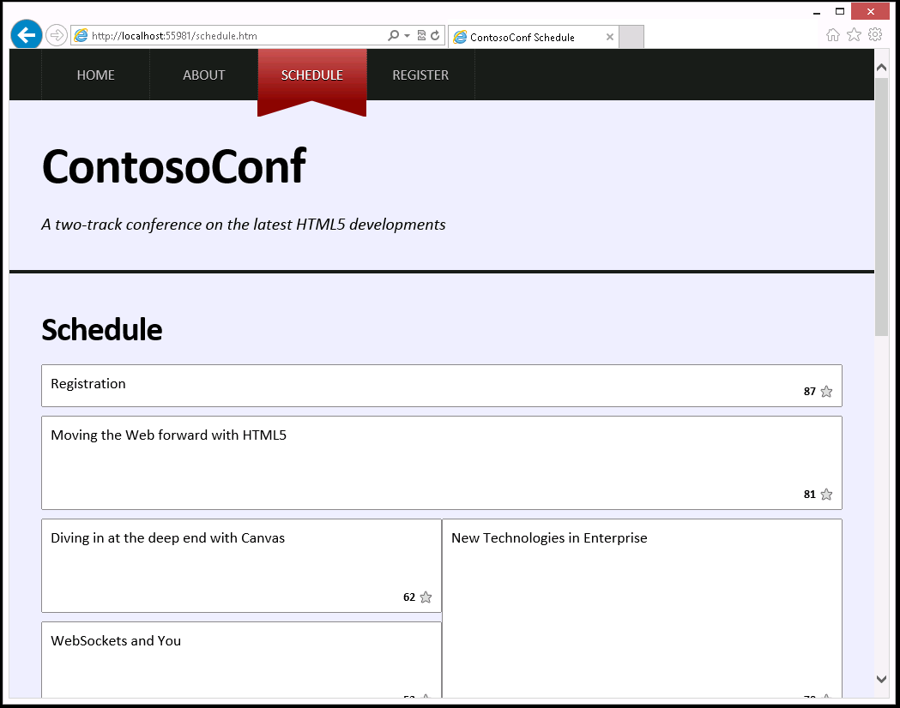

# Module 7: Creating Objects and Methods by Using JavaScript

Wherever a path to a file starts with *[Repository Root]*, replace it with the absolute path to the folder in which the 20480 repository resides. For example, if you cloned or extracted the 20480 repository to **C:\Users\John Doe\Downloads\20480**, change the path: **[Repository Root]\AllFiles\20480C\Mod01** to **C:\Users\John Doe\Downloads\20480\AllFiles\20480C\Mod01**.

# Lab: Refining Code for Maintainability and Extensibility

### Lab Setup

### Preparation Steps

Ensure that you have cloned the 20480C directory from GitHub (**https://github.com/MicrosoftLearning/20480-Programming-in-HTML5-with-JavaScript-and-CSS3/tree/master/Allfiles**). It contains the code segments for the labs and demos in this course.

### Exercise 1: Refactoring JavaScript Code to Use Classes and Objects

#### Task 1: Create the ScheduleList class

1.	In Microsoft Visual Studio, on the **File** menu, point to **Open**, and then click **Project/Solution**.
2.	In the **Open Project** dialog box, browse to **[Repository Root]\Allfiles\Mod07\Labfiles\Starter\Exercise 1**, click **ContosoConf.sln**, and then click **Open**.
>**Note**: If **Security Warning for ContosoConf** dialog box appears, clear **Ask me for every project in this solution** checkbox and then click **OK**.
3.	Expand the **ContosoConf** project, expand the **scripts** folder, and then expand the **pages** folder.
4.	Double-click **schedule.js**.
5.	Find the following comment:
    ```javascript
        // TODO: Create a ScheduleList class.
    ```
6. Right-click the **scripts** folder, point to **Add**, and then select **JavaScript File**.
7. For item name, add **ScheduleList.js**, and then click **Ok**.
8. Add the following JavaScript code:
	```javascript
		import { ScheduleItem } from "./ScheduleItem.js";

		export class ScheduleList {
			//TODO: Add Constructor
		}
		
		//TODO: Add methods
	```
9.	In **schedule.js**, find and remove the following comment:
	```javascript
        // TODO: Create a ScheduleList class.
    ```

#### Task 2: Convert variables into properties of the ScheduleList class

1.	In **schedule.js**, find the following comment:
    ```javascript
        // TODO: Refactor these variables into properties of the ScheduleList class.
		//		 Assign them in the "initialize" method from arguments
    ```
2.	Delete the following line of JavaScript code after this comment:
    ```javascript
        const element, localStarStorage;
    ```

3.	In **ScheduleList.js**, find the following JavaScript code:
    ```javascript
        //TODO: Add Constructor
    ```
4.	Replace the code with the following line of JavaScript code:
    ```javascript
        constructor(element, localStarStorage) {
			this.element = element;
			this.localStarStorage = localStarStorage;
		}
    ```
#### Task 3: Convert functions into methods of the ScheduleList class

1.	In **schedule.js**, find the following JavaScript code:
    ```javascript
        // TODO: Refactor these functions into methods of the ScheduleList class.
    ```
2.	Delete the **startDownload**, **downloadDone**, **downloadFailed**, **addAll**, and **add** functions that follow this comment.
3.  In **ScheduleList.js**, find the following comment:
    ```javascript
        //TODO: Add methods
    ```
3.	Replace the code with the following JavaScript code:
    ```javascript
		async startDownload() {
			// await response of fetch call
			let response = await fetch("/schedule/list")
			// transform body to json
			let data = await response.json();
	
			// checking response is ok
			if (response.ok) {
				this.downloadDone(data);
			} else {
				this.downloadFailed();
			}
		}

		downloadDone(responseData) {
			this.addAll(responseData.schedule);
		}

		downloadFailed() {
			alert("Could not retrieve schedule data at this time. Please try again later.");
		}

		addAll(itemsArray) {
			itemsArray.forEach(this.add, this);
		}

		add(itemData) {
			const item = new ScheduleItem(itemData, this.localStarStorage);
			this.element.appendChild(item.element);
		}
    ```

#### Task 4: Create and use a ScheduleList object

1.	In **schedule.js**, find the following JavaScript code:
    ```javascript
        // TODO: Replace the following code by creating a ScheduleList object 
        //       and calling the startDownload method.
        element = document.getElementById("schedule");
        localStarStorage = LocalStarStorage.create(localStorage);
        startDownload();
    ```
2.	Delete this block of JavaScript code,  and then replace it with the following code:
    ```javascript
		const scheduleList = new ScheduleList(
			document.getElementById("schedule"),
			new LocalStarStorage(localStorage)
		);
		scheduleList.startDownload();
    ```
3.	Find the following JavaScript code:
    ```javascript
		//TODO: Import objects/functions from the modules/classes.
		import { LocalStarStorage } from "../LocalStarStorage.js";
		import { ScheduleItem } from "../ScheduleItem.js";
    ```
4.	Delete this block of JavaScript code,  and then replace it with the following code:
    ```javascript
		import { LocalStarStorage } from "../LocalStarStorage.js";
		import { ScheduleList } from "../ScheduleList.js";
    ```

#### Task 5: Test the application

1.	In **Solution Explorer**, double-click **schedule.htm**.
2.	On the **Debug** menu, click **Start Without Debugging**.
3.	In Microsoft Edge, if the **Intranet settings are turned off by default** of the **ScheduleList** object appears, click **Don’t show this message again**.
4.	Verify that the page looks similar to the image below:



5.	Close Microsoft Edge.
6.      Close all open windows.

>**Results**: On completing this exercise, you have used objects to refactor the JavaScript code for the **Schedule** page to be more maintainable.
After completing this exercise, you will have refactored the JavaScript code for the **Schedule** page to be more maintainable by using objects.

©2018 Microsoft Corporation. All rights reserved.

The text in this document is available under the  [Creative Commons Attribution 3.0 License](https://creativecommons.org/licenses/by/3.0/legalcode), additional terms may apply. All other content contained in this document (including, without limitation, trademarks, logos, images, etc.) are  **not**  included within the Creative Commons license grant. This document does not provide you with any legal rights to any intellectual property in any Microsoft product. You may copy and use this document for your internal, reference purposes.

This document is provided &quot;as-is.&quot; Information and views expressed in this document, including URL and other Internet Web site references, may change without notice. You bear the risk of using it. Some examples are for illustration only and are fictitious. No real association is intended or inferred. Microsoft makes no warranties, express or implied, with respect to the information provided here.
