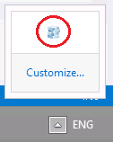

# Module 9: Adding Offline Support to Web Applications

Wherever a path to a file starts with *[Repository Root]*, replace it with the absolute path to the folder in which the 20480 repository resides. For example, if you cloned or extracted the 20480 repository to **C:\Users\John Doe\Downloads\20480**, change the path: **[Repository Root]\AllFiles\20480C\Mod01** to **C:\Users\John Doe\Downloads\20480\AllFiles\20480C\Mod01**.

# Lab: Adding Offline Support to Web Applications

### Lab Setup

### Preparation Steps

Ensure that you have cloned the 20480C directory from GitHub (**https://github.com/MicrosoftLearning/20480-Programming-in-HTML5-with-JavaScript-and-CSS3/tree/master/Allfiles**). It contains the code segments for the labs and demos in this course.

### Exercise 1: Caching Offline Data by Using the Application Cache API

#### Task 1: Configure the application cache manifest

1.	On the **Start** menu, click the **Desktop** tile.
2.	On the taskbar, click Microsoft Edge.
3.	In Microsoft Edge, to display the menu bar, press F10.
4.	On the **Tools** menu, click **Internet options**.
5.	In the **Internet Options** dialog box, click **Settings**.
6.	In the **Website Data Settings** dialog box, click the **Caches and databases** tab.
7.	Select the **Allow website caches and databases** check box, and then click **OK**.
8.	In the **Internet Options** dialog box, click **OK**.
9.	Close Microsoft Edge.
10.	Open Microsoft Visual Studio 2017. 
11.	In Microsoft Visual Studio, on the **File** menu, point to **Open**, and then click **Project/Solution**.
12.	In the **Open Project** dialog box, browse to **[Repository Root]\Allfiles\Mod09\Labfiles\Starter\Exercise 1**, and then open the **ContosoConf.sln** solution.
>**Note**: If **Security Warning for ContosoConf** dialog box appears, clear **Ask me for every project in this solution** checkbox and then click **OK**.
13.	In **Solution Explorer**, expand the **ContosoConf** project node, and then double-click **appcache.manifest**.
14.	Find the following comment:
   ```javascript
        # TODO: Add index, about, schedule and location pages
   ```
15.	After the comment, type the following URLs:
   ```javascript
        /index.htm
        /about.htm
        /location.htm
        /schedule.htm
   ```
16.	In **Solution Explorer**, double-click **index.htm**. 
17.	Add the **manifest** attribute to the **&lt;html&gt;** element, as shown below:
   ```html
        <html lang="en" manifest="/appcache.manifest">
   ```
18.	In **Solution Explorer**, double-click **about.htm**.
19.	Add the manifest attribute to the **&lt;html&gt;** element, as shown below:
   ```html
        <html lang="en" manifest="/appcache.manifest">
   ```
20.	In **Solution Explorer**, double-click **schedule.htm**.
21.	Add the **manifest** attribute to the **&lt;html&gt;** element, as shown below:
   ```html
        <html lang="en" manifest="/appcache.manifest">
   ```
22.	In **Solution Explorer**, double-click **location.htm**.
23.	Add the **manifest** attribute to the **&lt;html&gt;** element, as shown below:
   ```html
        <html lang="en" manifest="/appcache.manifest">
   ```

#### Task 2: Detect offline mode by using a JavaScript code

1.	In **Solution Explorer**, expand the **scripts** folder, and then double-click **offline.js**.
2.	Find the following comment:
   ```javascript
        // TODO: if currently offline, hide navigation links that require online
   ```
3.	After this comment, add the following JavaScript code:
   ```javascript
        if (!navigator.onLine) {
            hideLinksThatRequireOnline();
        }
   ```
4.	Find the following comment:
   ```javascript
        // TODO: add onoffline and ononline events to document.body
   ```
5.	After the second line of this comment, add the following JavaScript code:
   ```javascript
        document.body.onoffline = hideLinksThatRequireOnline;
        document.body.ononline = showLinks;
   ```
6.	Find the following comment:
   ```javascript
        // TODO: also handle the applicationCache error event to hide links
   ```
7.	After this comment, add the following JavaScript code:
   ```javascript
        applicationCache.addEventListener("error", hideLinksThatRequireOnline, false);
   ```

#### Task 3: Test the application

1.	In **Solution Explorer**, double-click **index.htm**.
2.	On the **Debug** menu, click **Start Without Debugging**.
3.	In **Microsoft Edge**, if the **Intranet settings are turned off by default** message appears, click **Don’t show this message again**.
4.	Verify that Microsoft Edge displays the **Home** page.
5.	Expand the Windows notification area, right-click **IIS Express**, and then select **Exit**.

>**Note**: When **IIS Express** first starts running, the **IIS Express** icon may appear on the taskbar rather than the notification area. If this occurs, right-click the **IIS Express** icon on the taskbar, and then select **Exit**.




6.	In the **Confirmation** dialog box, click **Yes**.
7.	In Microsoft Edge, click **Schedule**.
8.	Verify that the page loads and displays the schedule information.
9.	Wait for five seconds, and then verify that the website navigation bar no longer displays the **Register** link.
10.	Click **About**.
11.	Verify that the page loads and displays the information describing the conference.
12.	Verify that the website navigation bar does not display the **Register** link.
13.	Close Microsoft Edge.

>**Results**: After completing this exercise, you will have modified the web application and made the **Home**, **About**, **Schedule**, and **Location** pages available offline.

### Exercise 2: Persisting User Data by Using the Local Storage API

#### Task 1: Observe the current behavior of the Schedule page

1.	In Microsoft Visual Studio, on the **File** menu, click point to **Open**, and then click **Project/Solution**.
2.	In the **Open Project** dialog box, browse to **[Repository Root]\Allfiles\Mod09\Labfiles\Starter\Exercise 2**, and then open the **ContosoConf.sln** solution.
>**Note**: If **Security Warning for ContosoConf** dialog box appears, clear **Ask me for every project in this solution** checkbox and then click **OK**.
3.	In **Solution Explorer**, expand the **ContosoConf** project, and then double-click **schedule.htm**.
4.	On the **Debug** menu, click **Start Without Debugging**.
5.	Expand the Windows notification area, right-click **IIS Express**, and then select **Exit**.
6.	In the **Confirmation** dialog box, click **Yes**.
7.	In Microsoft Edge, in the **Registration** box, click the star icon, and then verify that the icon is now colored yellow.
8.	Click **Refresh**.
9.	Verify that the star icon for **Registration** is now colored white.
10.	Close Microsoft Edge.

#### Task 2: Save information about starred sessions to local storage

1.	In **Solution Explorer**, expand the **ContosoConf** project, expand the **scripts** folder, and then double-click **LocalStarStorage.js**.
2.	Find the following comments:
   ```javascript
        // TODO: convert this.sessions into a JSON string

        // TODO: save this JSON string into local storage as "stars"
   ```
3.	After the second comment, insert the following JavaScript code:
   ```javascript
        this.localStorage.setItem("stars", JSON.stringify(this.sessions));
   ```

#### Task 3: Load information about starred sessions from local storage

1.	In **LocalStarStorage.js**, find the following comment:
   ```javascript
        // TODO: get the "stars" from local storage
   ```
2.	After this comment, add the following JavaScript code:
   ```javascript
        var json = this.localStorage.getItem("stars");
   ```
3.	Find the following comments:
   ```javascript
        // TODO: parse the JSON string into this.sessions
        
        // TODO: handle failures due to missing data etc
   ```
4.	After the second comment, add the following JavaScript code:
   ```javascript
        if (json) {
            try {
                this.sessions = JSON.parse(json) || [];
            } catch (exception) {
                this.sessions = [];
            }
        } else {
            this.sessions = [];
        }
   ```

#### Task 4: Use the local storage wrapper to save and load data in the Schedule page

1.	In **Solution Explorer**, expand the **scripts** folder, then double-click **ScheduleItem.js**.
2.	Find the following comment:
   ```javascript
        // TODO: Check if item is starred
   ```
3.	After this comment, add the following JavaScript code:
   ```javascript
        if (localStarStorage.isStarred(this.id)) {
            this.element.classList.add(this.starredClass);
        }
   ```
4.	Find the following comment:
   ```javascript
        // TODO: remove the star from the item
   ```
5.	After this comment, add the following JavaScript code:
   ```javascript
        this.localStarStorage.removeStar(this.id);
   ```
6.	Find the following comment:
   ```javascript
        // TODO: add a star to the item
   ```
7.	After this comment, add the following JavaScript code:
   ```javascript
        this.localStarStorage.addStar(this.id);
   ```

#### Task 5: Test the application

1.	In **Solution Explorer**, double-click **appcache.manifest**.
2.	Find the following line:
   ```javascript
        CACHE MANIFEST
   ```
3.	After the line, insert the following line:
   ```javascript
        # version 2
   ```
4.	In **Solution Explorer**, double-click **schedule.htm**.
5.	On the **Debug** menu, click **Start Without Debugging**.
6.	In Microsoft Edge, to refresh the page, press F5.
7.	Expand the Windows notification area, right-click **IIS Express**, and then select **Exit**.
8.	In the **Confirmation** dialog box, click **Yes**.
9.	In Microsoft Edge, click the star icon in the **Registration** box, and then verify that the icon is now colored yellow.
10.	Press F5.
11.	Verify that the star icon for **Registration** is still colored yellow.
12.	Close Microsoft Edge.

#### Task 6: Reset Microsoft Edge caching

1.	On the taskbar, click **Microsoft Edge**.
2.	In Microsoft Edge, to display the menu bar, press F10.
3.	On the **Tools** menu, click **Internet options**.
4.	In the **Internet Options** dialog box, click **Settings**.
5.	In the **Website Data Settings** dialog box, click the **Caches and databases** tab.
6.	Clear the **Allow website caches and databases** check box, and then click **OK**.
7.	In the **Internet Options** dialog box, click **OK**.
8.	Close Microsoft Edge.
9. Close all open windows.

>**Results**: After completing this exercise, you will have updated the **Schedule** page to record starred sessions locally.

©2018 Microsoft Corporation. All rights reserved.

The text in this document is available under the  [Creative Commons Attribution 3.0 License](https://creativecommons.org/licenses/by/3.0/legalcode), additional terms may apply. All other content contained in this document (including, without limitation, trademarks, logos, images, etc.) are  **not**  included within the Creative Commons license grant. This document does not provide you with any legal rights to any intellectual property in any Microsoft product. You may copy and use this document for your internal, reference purposes.

This document is provided &quot;as-is.&quot; Information and views expressed in this document, including URL and other Internet Web site references, may change without notice. You bear the risk of using it. Some examples are for illustration only and are fictitious. No real association is intended or inferred. Microsoft makes no warranties, express or implied, with respect to the information provided here.
