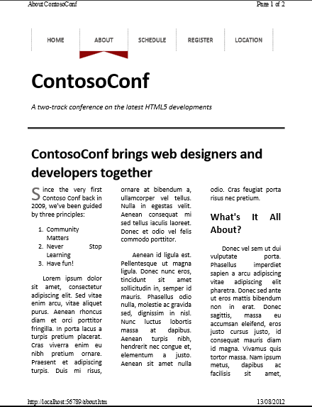
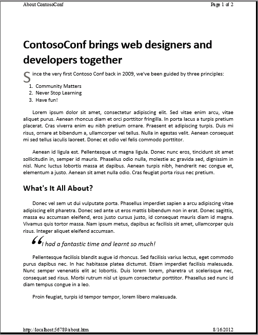
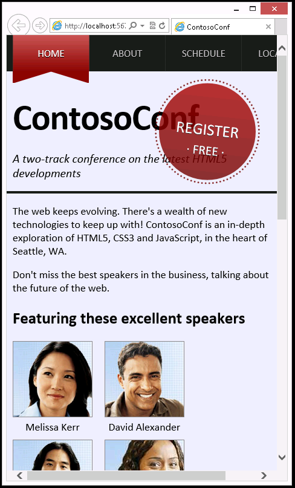

## Module 10: Implementing an Adaptive User Interface

Wherever a path to a file starts with *[Repository Root]*, replace it with the absolute path to the folder in which the 20480 repository resides. For example, if you cloned or extracted the 20480 repository to **C:\Users\John Doe\Downloads\20480**, change the path: **[Repository Root]\AllFiles\20480C\Mod01** to **C:\Users\John Doe\Downloads\20480\AllFiles\20480C\Mod01**.

## Lab: Implementing an Adaptive User Interface

#### Scenario

Most conference attendees are expected to use a laptop to view the live version of the Contoso Conference website, but some may wish to print a hard copy of some of the information. Other attendees might use smartphones or other handheld devices to view the website. The different requirements and form factors of a printer or a handheld device compared to a laptop make it necessary for the user interface of the web application to detect device capabilities and adapt itself accordingly. For example, some website elements, such as the header, are not necessary for printing, while the smaller screens of smartphones are not ideal for viewing full-sized websites.

#### Objectives

After completing this lab, you will be able to:
- Create style sheets that apply only when printing a web page.
- Use CSS media queries to enable a web page to adapt to different device form factors.

#### Lab Setup

Estimated Time: **60 minutes**

### Exercise 1: Creating a Print-Friendly Style Sheet

#### Scenario

In this exercise, you will add a style sheet for formatting web pages in a style suitable for printing. You will ensure that this style sheet is used only when a page is being printed.

In the style sheet, you will add rules to override the layout of the website, remove the header and footer, and reformat the **About** page to display the information in a single wide column. To test the application, you will view the **About** page and verify that the print preview displays a correctly formatted version of the page.

#### Task 1: Review the existing application

1.	Start Microsoft Visual Studio, and then from the **[Repository Root]\Allfiles\Mod10\Labfiles\Starter\Exercise 1** folder, open the **ContosoConf.sln** solution.
2.	Run the application, and then view the **about.htm** page.
3.	On the **About** page press **Ctrl+P**  to open the **Print Preview** window. Notice that the print preview attempts to display the page header and that the text columns are too narrow.



4.	Close the **About ContosoConf - Print** window and then close Microsoft Edge.
5.	In ContosoConf - Microsoft Visual Studio, examine the about.htm page and verify that the **&lt;nav&gt;** element is marked with the **page-nav** class, the **&lt;header&gt;** element is marked with the **page-header** class, and the **&lt;footer&gt;** element is marked with the **page-footer** class, as follows:
```html
    <nav class="page-nav">

    <header class="page-header">

    <footer class="page-footer">
```
You will use these classes to style the elements when the page is printed.

#### Task 2: Create a style sheet for printing web pages

1.	In the ContosoConf project, in the **styles** folder, add a new style sheet named **print.css**.
- Use the **Add New Item** wizard and the **Style Sheet** template on the **Web** tab.
2.	In the **print.css** style sheet, delete the existing content, and then add a CSS rule to hide the **nav** element that has the **page-nav** class, the **header** element that has the **page-header** class, and the **footer** element that has the **page-footer** class.
- Set the **display** property of these elements to **none**.
3.	Add a CSS rule for the **.container** class, which overrides the CSS from **site.css**.
- When printing, container elements should have no maximum width or padding.
4.	In the **styles/pages** folder, the **about.css** style sheet contains the following CSS rule to display the page text in columns.
    ```css
        .about > article > section {
            text-align: justify;

            /* Columns Layout */
            column-count: 3;
            column-gap: 5rem; ;
        }
    ```
5. In **print.css**, add a CSS rule that removes the columns, so that the text displays as a single block.
- You only need to set the **column-count** property in this rule.

#### Task 3: Link the print style sheet to the About page

- In the **About** page, in the **&lt;head&gt;** section, add a link to **print.css** where indicated by the comment &lt;!-- TODO: Add print.css &lt;link&gt; here --&gt;. Set the **media** attribute of the link so that the style sheet is used only when printing.

#### Task 4: Test the application

1.	Run the application, and then view the **About** page.
2.	Refresh the page to ensure that the most recent version of the **About** page is loaded.
3.	In Microsoft Edge, open the **Print Preview** window and verify that the preview does not display the navigation, header, or footer and that the text has no columns.



4.	Close the **About ContosoConf - Print** window, and then close Microsoft Edge.

>**Results**: After completing this exercise, you will have added a style sheet that implements a print-friendly format for the web pages.

### Exercise 2: Adapting Page Layout to Fit Different Form Factors

#### Scenario

In this exercise, you will create a style sheet that enables the pages in the Contoso Conference website to adapt to different device form factors.

First, you will view the application running in a small window to simulate a small device, such as a smartphone. Then, you will use CSS media queries to define rules that change the website layout to better suit small devices.
Finally, you will run the application again and verify that the website layout adapts to large and small screen sizes.

#### Task 1: Simulate the web application running on a small device

1.	In Visual Studio, from the **[Repository Root]\Allfiles\Mod10\Labfiles\Starter\Exercise 2** folder, open the **ContosoConf** solution.
2.	Run the application, and then view the **index.htm** page.
3.	Resize Microsoft Edge to **800 x 480**, approximating the form factor of a Windows Phone 8 device.

>**Note**: Use the F12 Developer Tools to change the size of the device viewing the website. The **Resize** command on the **Tools** menu enables you to change the size of the browser.

4.	Notice that the website navigation bar does not fit on the screen and that the big **Register** link overlaps the header text.



5.	Close Microsoft Edge.

#### Task 2: Implement styles for hand-held devices and smartphones

1.	From the styles **folder**, open the **mobile.css** style sheet. This style sheet is referenced in the **&lt;head&gt;** element of each page in the website. This style sheet is currently empty, but you will use it to specify the styles for hand-held devices and smartphones.
2.	Add a CSS media query that targets screens that are less than or equal to 480 pixels in width.
3.	In the media query, add a rule for **nav.page-nav .container** that uses a flexbox to display the contents of the navigation bar, as follows:
   ```css
        display: -ms-flexbox;
        -ms-flex-wrap: wrap;
        -ms-flex-pack: center;
   ```
4.	Add another rule that hides the **:before** and **:after** pseudo elements of the **.active** navigation link.
- Set the **display** property to none.
5.	Add another rule that sets a **.5rem** margin around each navigation link. This rule should also set a **1px** dotted border with the color **#3d3d3d** completely around the link, instead of just on the right.
6.	The default layout of the website header is not suitable for screens less than 720 pixels wide. Add another media query to **mobile.css** that targets screen widths up to 720 pixels.
7.	In this media query, add rules that perform the following actions:
- Reduce the height of the page header (set the **height** to **auto**).
- Hide the large **Register** link in the page header.
- Reduce the **font-size** of the **&lt;h1&gt;** element in the page header to **3rem**.

#### Task 3: Test the application

1.	Run the application, and then view the **Home** page.
2.	To resize Microsoft Edge to various sizes to test that the media queries adapt the user interface correctly, use F12 Developer Tools.
- As a minimum, try the sizes 1280x1024 and 480x800.
3.	Close Microsoft Edge.

>**Result**: After completing this exercise, you will have a website that adapts to different screen sizes.

©2018 Microsoft Corporation. All rights reserved.

The text in this document is available under the  [Creative Commons Attribution 3.0 License](https://creativecommons.org/licenses/by/3.0/legalcode), additional terms may apply. All other content contained in this document (including, without limitation, trademarks, logos, images, etc.) are  **not**  included within the Creative Commons license grant. This document does not provide you with any legal rights to any intellectual property in any Microsoft product. You may copy and use this document for your internal, reference purposes.

This document is provided &quot;as-is.&quot; Information and views expressed in this document, including URL and other Internet Web site references, may change without notice. You bear the risk of using it. Some examples are for illustration only and are fictitious. No real association is intended or inferred. Microsoft makes no warranties, express or implied, with respect to the information provided here.
