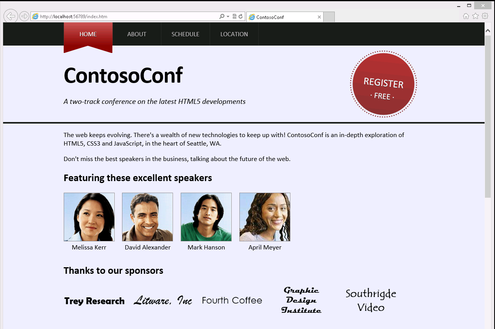
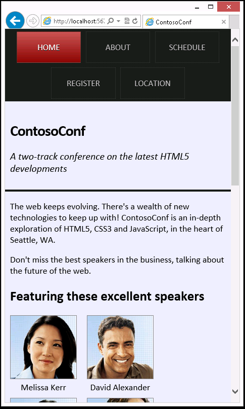

# Module 10: Implementing an Adaptive User Interface

# Lab: Implementing an Adaptive User Interface

### Lab Setup

### Preparation Steps

1. Ensure that you have cloned the 20480C directory from GitHub (**https://github.com/MicrosoftLearning/20480-Programming-in-HTML5-with-JavaScript-and-CSS3/tree/master/Allfiles**). It contains the code segments for the labs and demos in this course.
2. Before you start this exercise, make sure that you have disabled caching in Microsoft Edge. To do this:
    - Open Microsoft Edge.
    - Press F12.
    - Click the **Network** tab.
    - Click **Always refresh from server**.

### Exercise 1: Creating a Print-Friendly Style Sheet

#### Task 1: Review the existing application

1.	Open Microsoft Visual Studio 2017.
2.	In Visual Studio, on the **File** menu, point to **Open**, and then select **Project/Solution**.
3.	In the **Open Project** dialog box, browse to **Allfiles\Mod10\Labfiles\Starter\Exercise 1**, click **ContosoConf.sln**, and then click **Open**.
4.	In Visual Studio, in **Solution Explorer**, expand the **ContosoConf** project, and then double-click **about.htm**.
5.	On the **Debug** menu, click **Start Without Debugging**.
6.	In Microsoft Edge, if the **Intranet settings are turned off by default** message appears, click **Don’t show this message again**.
7.	To display the menu bar, press F10.
8.	On the **File** menu, click **Print preview**.
9.	In the **Print Preview** window, verify that the preview looks like the following image:


10.	Close the **Print Preview** window.
11.	Close Microsoft Edge.
12.	In Visual Studio, in **Solution Explorer**, double-click **about.htm**.
13.	Verify that the file contains the following HTML markup:
    ```html
        <nav class="page-nav">

        <header class="page-header">

        <footer class="page-footer">
    ```

#### Task 2: Create a style sheet for printing web pages

1.	In Visual Studio, in **Solution Explorer**, click the **styles** folder.
2.	On the **Project** menu, click **Add New Item**.
3.	In the **Add New Item - ContosoConf** dialog box, in the left pane, expand the **Visual C#** node, and then click **Web**.
4.	In the middle pane, click **Style Sheet**.
5.	In the **Name** box, type **print.css**.
6.	Click **Add**.
7.	In **print.css**, delete the existing file content.
8.	Add the following CSS:
    ```css
        nav.page-nav,
        header.page-header,
        footer.page-footer {
            display: none;
        }

        .container {
            padding: 0;
            max-width: none;
        }
    ```
9.	In **print.css**, at the end of the file, add the following CSS:
    ```css
        .about > article > section {
            column-count: 1;
        }
    ```

#### Task 3: Link the print style sheet to the About page

1.	In **Solution Explorer**, double-click **about.htm**.
2.	Find the following comment:
    ```html
        <!-- TODO: Add print.css <link> here -->
    ```
3.	After the comment, add the following HTML:
    ```html
        <link href="/styles/print.css" media="print" rel="stylesheet" type="text/css" />
    ```

#### Task 4: Test the application

1.	On the **Debug** menu, click **Start Without Debugging**.
2.	To refresh the page, in Microsoft Edge, press F5.
3.	To display the menu bar, press F10.
4.	On the **File** menu, click **Print preview**.
5.	Verify that the **Print Preview** window displays the following image:


6.	Close the **Print Preview** window.
7.	Close Microsoft Edge.

>**Results**: After completing this exercise, you will have added a style sheet that implements a print-friendly format for web pages.

### Exercise 2: Adapting Page Layout to Fit Different Form Factors

#### Task 1: Simulate the web application running on a small device

1.	In Visual Studio, on the **File** menu, point to **Open**, and then select **Project/Solution**.
2.	In the **Open Project** dialog box, browse to **Allfiles\Mod10\Labfiles\Starter\Exercise 2**, click **ContosoConf.sln**, and then click **Open**.
3.	In **Solution Explorer**, expand the **ContosoConf** project, and then double-click **index.htm**.
4.	On the **Debug** menu, click **Start Without Debugging**.
5.	In Microsoft Edge, press F12.
6.	In the **ContosoConf – F12** window, on the **Tools** menu, point to **Resize**, and then select **480x800**.
7.	Press F12.
8.	Verify that the **Home** page looks similar to the following image:


9.	Close Microsoft Edge.

#### Task 2: Implement styles for hand-held devices and smartphones

1.	In **Solution Explorer**, expand the **styles** folder, and then double-click **mobile.css**.
2.	Add the following CSS to the file:
    ```css
        @media screen and (max-width: 480px) {
        }
    ```
3.	Add the CSS rules shown below in bold to the file: 
    ```css
        @media screen and (max-width: 480px) {
            nav.page-nav .container {
                display: -ms-flexbox;
                -ms-flex-wrap: wrap;
                -ms-flex-pack: center;
            }

            nav.page-nav .active:before,
            nav.page-nav .active:after {
                display: none;
            }

            nav.page-nav a {
                border: 1px dotted #3d3d3d;
                margin: .5rem;
            }
        }
    ```
4.	Add the following CSS to the end of the file:
    ```css
        @media screen and (max-width: 720px) {
            header.page-header {
                height: auto;
            }

            header.page-header .register {
                display: none;
            }

            header.page-header h1 {
                font-size: 3rem;
            }
        }
    ```

#### Task 3: Test the application

1.	In **Solution Explorer**, double-click **index.htm**.
2.	On the **Debug** menu, click **Start Without Debugging**.
3.	In Microsoft Edge, press F12.
4.	In the **ContosoConf – F12** window, on the **Tools** menu, point to **Resize**, and then select **1280×1024**.
5.	Press F12.
6.	Verify that the **Home** page is displayed correctly on the desktop.



7.	Press F12.
8.	In the **ContosoConf – F12** window, on the **Tools** menu, point to **Resize**, and then select **480×800**.
9.	Press F12.
10.	Verify that the navigation bar is displayed correctly in the reduced form factor (it wraps), and that the **Register** link does not appear in the header of the web page.



11.	Close Microsoft Edge.

>**Results**: After completing this exercise, you will have a website that adapts to different screen sizes.

©2018 Microsoft Corporation. All rights reserved.

The text in this document is available under the  [Creative Commons Attribution 3.0 License](https://creativecommons.org/licenses/by/3.0/legalcode), additional terms may apply. All other content contained in this document (including, without limitation, trademarks, logos, images, etc.) are  **not**  included within the Creative Commons license grant. This document does not provide you with any legal rights to any intellectual property in any Microsoft product. You may copy and use this document for your internal, reference purposes.

This document is provided &quot;as-is.&quot; Information and views expressed in this document, including URL and other Internet Web site references, may change without notice. You bear the risk of using it. Some examples are for illustration only and are fictitious. No real association is intended or inferred. Microsoft makes no warranties, express or implied, with respect to the information provided here.
