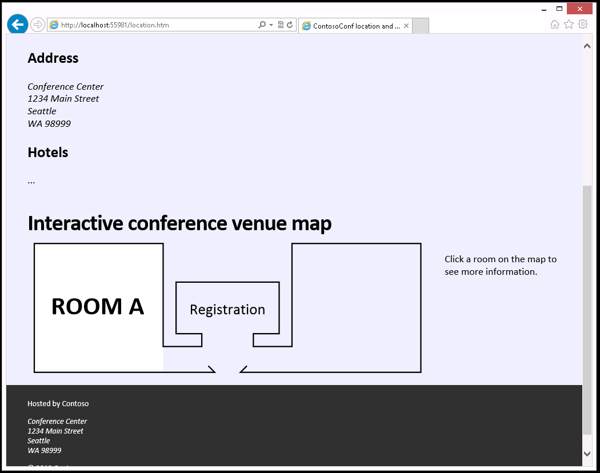
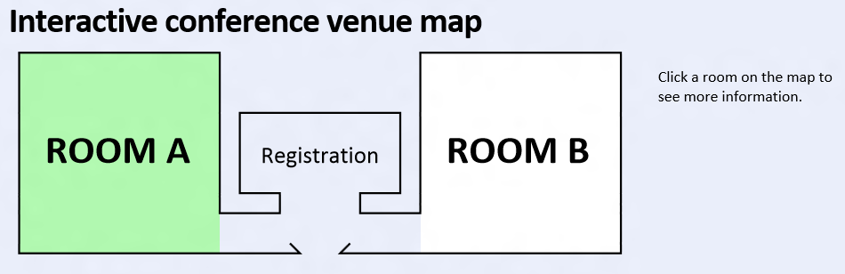
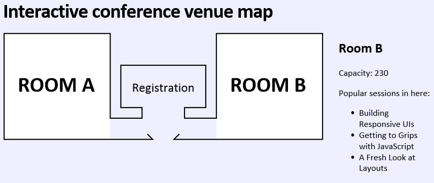
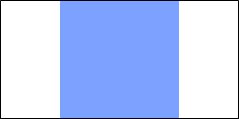
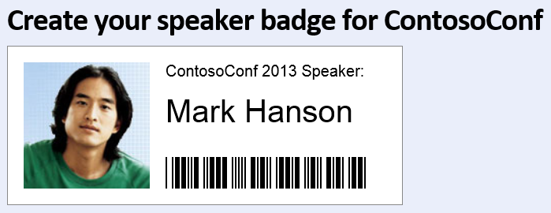

## Module 11: Creating Advanced Graphics
Wherever a path to a file starts with *[Repository Root]*, replace it with the absolute path to the folder in which the 20480 repository resides. For example, if you cloned or extracted the 20480 repository to **C:\Users\John Doe\Downloads\20480**, change the path: **[Repository Root]\AllFiles\20480C\Mod01** to **C:\Users\John Doe\Downloads\20480\AllFiles\20480C\Mod01**.

## Lab: Creating Advanced Graphics

#### Scenario

The conference organizers would like a venue map displayed on the website. The conference attendees will use the map to find out more about the rooms in the conference facility. Therefore, the map should be interactive and should respond to mouse clicks. The floor plans are available in a vector format, so they can be displayed in a resolution-independent format.

The conference speakers need badges with their photo, name, and ID. The ID is in the form of a barcode to make it easy for security personnel to scan and verify the holder’s identity before allowing backstage access. You have been asked to create a webpage that enables a speaker to create a badge.

#### Objectives

After completing this lab, you will be able to:
- Create graphics by using Scalable Vector Graphics (SVG), interactively style SVG graphics, and handle SVG graphics events.
- Draw graphics by using the Canvas API.

#### Lab Setup

Estimated Time: **60 minutes**

### Exercise 1: Creating an Interactive Venue Map by Using SVG

#### Scenario

In this exercise, you will create an interactive conference venue map.

First, you will complete the partially completed SVG markup of the venue map. Next, you will add interactive styling to the SVG by using Cascading Style Sheets (CSS). Then, you will handle SVG element click events to display extra information about the conference rooms. Finally, you will run the application, view the **Location** page, and then verify that the venue map is interactive.

#### Task 1: Review the incomplete HTML markup for the venue map

1.	Start Microsoft Visual Studio, browse to **[Repository Root]\Allfiles\Mod11\Labfiles\Starter\Exercise 1**, and then open the **ContosoConf.sln** solution.
2.	Open the **location.htm** file.
3.	Verify that the page contains the following **&lt;svg&gt;** element of the venue map, and two hidden **&lt;div&gt;** elements containing room information:
   ```html
        <svg viewBox="-1 -1 302 102" width="100%" height="230">
            <!-- Room A -->
            <g id="room-a" class="room">
                <rect fill="#fff" x="0" y="0" width="100" height="100"/>
                <text x="13" y="55" font-weight="bold" font-size="20">ROOM A</text>
            </g>
            <!-- Room B -->

            <!-- The outline of the building -->
            <polyline fill="none" stroke="#000" points="135,95 140,100 0,100 0,0 100,0 100,80 130,80 130,70 110,70 110,30 190,30 190,70 170,70 170,80 200,80 200,0 300,0 300,100 160,100 165, 95"/>
            <text x="150" y="55" font-size="12" style="text-anchor:middle">Registration</text>
        </svg>
   ```

Also notice that the script references the **location-venue.js** script in the **scripts/pages** folder:
  ```html
        <script src="/scripts/pages/location-venue.js" type="text/javascript"></script>
  ```
4.	Run the application, and then view the **Location** page. Notice that the details for Room B are missing:



5.	Close Microsoft Edge.

#### Task 2: Complete the SVG venue map

1.	In the **location.htm** file, to add the SVG elements for Room B, use **room-b** as the group element ID. The missing elements are a filled rectangle and the text with the name of the room. Use the SVG elements for Room A as a guide.

>**Note**: You may need to view the page in Microsoft Edge and experiment with the coordinate values to get elements in the correct location.

#### Task 3: Add interactivity to the venue map

1.	The venue map should be interactive; a user should be able to view more information about a room by clicking it in the map. In the **location.htm** file, find the following **&lt;div&gt;** elements. These elements contain the information about each room, but they are hidden by default:
   ```html
        <div id="room-a-info" style="display: none">
          <h2>Room A</h2>
          <p>Capacity: 250</p>
          <p>Popular sessions in here:</p>
          <ul>
            <li>Diving in at the deep end with Canvas</li>
            <li>Real-world Applications of HTML5 APIs</li>
            <li>Transforms and Animations</li>
          </ul>
        </div>
        <div id="room-b-info" style="display: none">
          <h2>Room B</h2>
          <p>Capacity: 230</p>
          <p>Popular sessions in here:</p>
          <ul>
            <li>Building Responsive UIs</li>
            <li>Getting to Grips with JavaScript</li>
            <li>A Fresh Look at Layouts</li>
          </ul>
        </div>
   ```
2.	Notice that each **&lt;div&gt;** is named after the room with the suffix **–info**.

>**Note**: The information for each room is hard-coded into the HTML markup. However, to make the page even more dynamic, you could retrieve information about popular sessions from the web service used in the **Schedule** page.

3.	The room should change color when the mouse pointer moves over it. From the **styles\pages** folder, open the **location.css** style sheet. This style sheet contains the CSS for the **location.htm** page.
4.	Add a CSS rule that targets **rect** elements when the mouse pointer is placed over **.room** elements.
5.	In this rule, set the **fill** property to **#b1f8b0**.
6.	In the **scripts\pages** folder, open the **location-venue.js** file. This JavaScript file contains the **showRoomInfo** function that displays information about a room. The ID of the room is specified as the parameter to this function.
7.	Add **click** event listeners for the SVG **room** elements, which call the **showRoomInfo** function.
- To find all the elements that have the class set to **.room**, after the __// TODO: Get the room elements in the svg element__ comment, use the **querySelectorAll** function of the document object, and then assign them to the **rooms** variable.
- After the __// TODO: Add a click event listener for each room element__ comment, iterate through the list of elements in the **rooms** variable, and then add the **click** event handler for each item.

#### Task 4: Test the application

1.	Run the application, and then view the **location.htm** page.
2.	Move the cursor over each room and verify that the fill color changes.



3.	Click each room and verify that the correct information is displayed next to the venue map.



4.	Close Microsoft Edge.

>**Results**: After completing this exercise, you will have a venue map that displays extra information when clicked.

### Exercise 2: Creating a Speaker Badge by Using the Canvas API

#### Scenario

In this exercise, you will use the Canvas API to draw the elements of a conference speaker’s badge.

First, you will create a canvas element on the speaker badge page. Next, you will write the JavaScript code to implement methods that draw parts of the badge. Finally, you will run the application and test the speaker badge page.

#### Task 1: Create the canvas element

1.	In ContosoConf - Microsoft Visual Studio, browse to **[Repository Root]\Allfiles\Mod11\Labfiles\Starter\Exercise 2**, and then open the **ContosoConf.sln** solution.
2.	Open the **speaker-badge.htm** file. This page contains a section that enables the user to create their speaker badge. Previously, you used an **&lt;img&gt;** element to drag an image of the speaker onto this page. This **&lt;img&gt;** element has been removed because you are going to modify the page to use a canvas. Using a canvas provides more scope for customizing the image.
3.	Find the following comment:
   ```html
        <!-- TODO: Add canvas here -->
   ```
4.	After the comment, add a **&lt;canvas&gt;** element with a **width** of **500** and a **height** of **200**.
5.	Add a solid black border to the canvas by using a CSS style. Set the width to **1px**.
6.	Add the following custom attributes to the canvas element:
   ```html
        data-speaker-id="234724"
        data-speaker-name="Mark Hanson"
   ```

>**Note**: The custom data attributes provide a convenient way to store application-specific data in an HTML element. They will be used by the JavaScript code that draws the elements for the badge on the canvas.
>
>In this exercise, these details are hard-coded into the HTML markup, but you could also write the JavaScript code to dynamically populate these attributes.

#### Task 2: Draw the details for the badge

1.	In the **scripts\pages** folder, open the **speakerbadgePage.js** file. The JavaScript code in this file contains a refactored version of the drag-and-drop code that you created during an earlier lab exercise. Notice that the canvas element on the page has been assigned to **this.canvas**:
   ```javascript
        this.canvas = element.querySelector("canvas");
   ```
The file also contains a number of other functions that will draw the various elements of the speaker's badge.

>**Note**: To do their drawing, the other drawing methods of the **speaker badge page** object will use the context assigned to **this.context**.

2.	In the **drawBadge** method, after the __// TODO: Get the canvas's (this.canvas) context and assign to this.context__ comment, assign **this.context** to be the canvas’s 2D context.
3.	After __// TODO: Draw the following by calling the helper methods of `this` comment__, add code to perform the following tasks:
- Draw the background. Use the **drawBackground** function.
- Draw the top text. Use the **drawTopText** function; this function simply generates the text **ContosoConf 2012 Speaker**, which is displayed at the top of the badge.
- Draw the speaker name. Use the **drawSpeakerName** function.
- If the **image** variable references a valid image, draw the speaker's image (use the **drawSpeakerImage** function and pass the **image** variable as the parameter); otherwise, draw a placeholder (use the **drawImagePlaceHolder** function).
- Draw the barcode (use the **drawBarCode** function and pass the value in the **speakerId** variable as the parameter).
4.	In the **drawBackground** method, after the __// TODO: Fill the canvas with a white rectangle__ comment, add statements to fill the canvas with a white rectangle.
- Set the **fillStyle** of the context to **"white"**.
- To draw and fill the rectangle, use the **fillRect** method of the context; the **width** and **height** properties of the rectangle should be the same as those of the canvas.
5.	In the **drawSpeakerImage** method, after the __// TODO: Draw the image on the canvas__ comment, add code to draw the image on the canvas at the coordinates **(20, 20)** with size **160 × 160**.
- Use the **drawImage** method of the context.
- Note that the image is not always square, so calculate the source coordinates and size that will display the central square portion only. Use the **Math.min** function to calculate the minimum of the image’s **width** and **height** properties, like this:
    ```javascript
        const size = Math.min(image.width, image.height);
    ```




6.	In the **drawSpeakerName** method, after the __// TODO: Draw this.speakerName on the canvas__ comment, add code to draw the speaker's name on the canvas:
- The speaker’s name is available in the **this.speakerName** property.
- To style the text before drawing it, configure the following properties of the canvas:
    - font: **40px sans-serif**
    - fillStyle: **black**
    - textBaseline: **top**
    - textAlign: **left**
    - fillText: *the speaker's name*

#### Task 3: Test the application

1.	Run the application, and then view the **speaker-badge.htm** page.
2.	Browse to **[Repository Root]\Allfiles\Mod11\Labfiles\Resources**, and then drag the **mark-hansen.jpg** image file onto the canvas.
3.	Verify that the image is drawn on the canvas, along with the speaker’s details.



4.	Close Microsoft Edge.
5. Close all open windows.

>**Result**: After completing this exercise, you will have a **Speaker Badge** page that enables conference speakers to create their badge.

©2018 Microsoft Corporation. All rights reserved.

The text in this document is available under the  [Creative Commons Attribution 3.0 License](https://creativecommons.org/licenses/by/3.0/legalcode), additional terms may apply. All other content contained in this document (including, without limitation, trademarks, logos, images, etc.) are  **not**  included within the Creative Commons license grant. This document does not provide you with any legal rights to any intellectual property in any Microsoft product. You may copy and use this document for your internal, reference purposes.

This document is provided &quot;as-is.&quot; Information and views expressed in this document, including URL and other Internet Web site references, may change without notice. You bear the risk of using it. Some examples are for illustration only and are fictitious. No real association is intended or inferred. Microsoft makes no warranties, express or implied, with respect to the information provided here.
