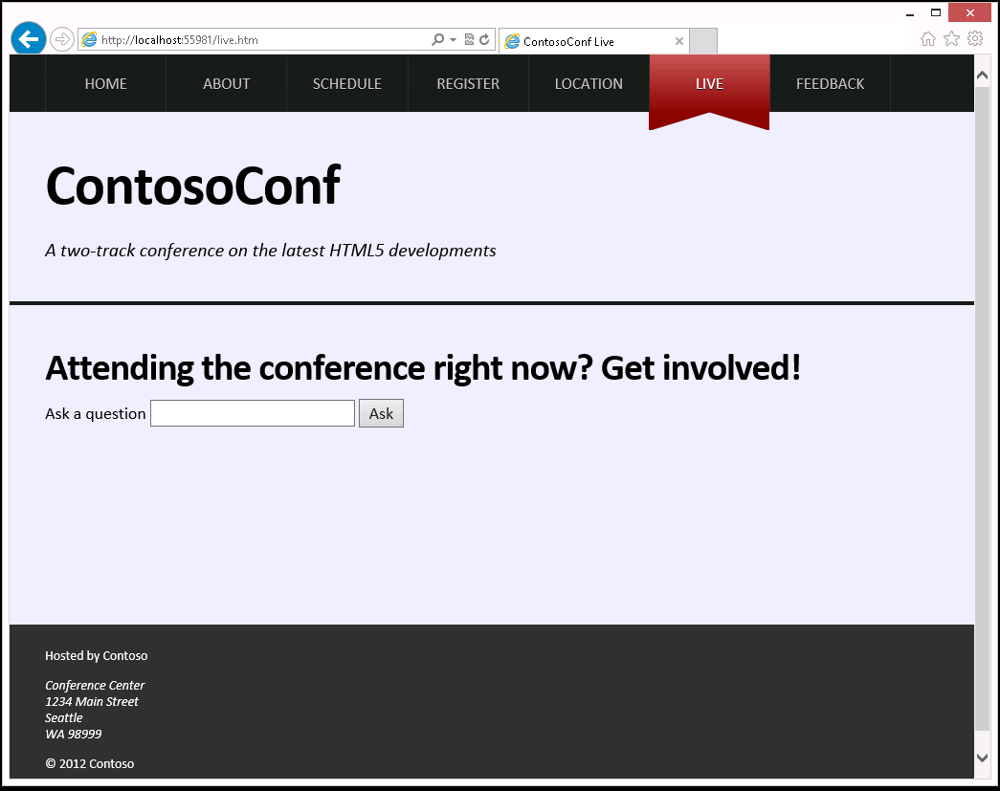

## Module 13: Implementing Real-time Communication by Using Web Sockets
Wherever a path to a file starts with *[Repository Root]*, replace it with the absolute path to the folder in which the 20480 repository resides. For example, if you cloned or extracted the 20480 repository to **C:\Users\John Doe\Downloads\20480**, change the path: **[Repository Root]\AllFiles\20480C\Mod01** to **C:\Users\John Doe\Downloads\20480\AllFiles\20480C\Mod01**.

## Lab: Performing Real-time Communication by Using Web Sockets

#### Scenario

During conference sessions, attendees may wish to ask questions. Distributing microphones among members of the audience can be problematic and slow, so you have been asked to add a page to the website that enables attendees to submit questions. Speakers can either respond immediately or later, depending on the nature of the questions and the session.

On the website, all questions must be displayed in real-time without reloading the page, so that all attendees and the speaker can see what has been asked. To support this requirement, a web socket server has been created. You need to update the web application to send the details of the questions to the socket server, and also to receive and display questions submitted by other attendees.

>**Note:** The web socket server is implemented by using ASP.NET and C#. The details of how this server works are outside the scope of this lab.

Conference organizers are concerned about people asking inappropriate questions. Therefore, a back-end moderation system is also being developed. Conference attendees should be able to report a question that they think is inappropriate. Administrators can then mark this question for removal. The web socket server will transmit a message to all connected clients, and the web page must be updated to remove the question.

#### Objectives

After completing this lab, you will be able to:
- Create a web socket that connects to a server and receives messages.
- Serialize and send messages to a web socket.
- Send and receive different types of messages by using a web socket.

#### Lab Setup

Estimated Time: **90 minutes**

### Exercise 1: Receiving Messages from a Web Socket

#### Scenario

In this exercise, you will review the new **Live** page and JavaScript. You will write JavaScript that creates a web socket and connects the socket to the server. Then you will handle messages received from the web socket. You will parse the JSON serialized messages into objects that contain new questions to display on the page. Finally, you will run the application, view the **Live** page and verify that it displays the questions sent by the socket server.

#### Task 1: Review the Live page

1.	Start Microsoft Visual Studio, and then from the **[Repository Root]\Allfiles\Mod13\Labfiles\Starter\Exercise 1** folder, open the **ContosoConf.sln** solution.
2.	Start the application, and then view the **Live** page. Ignore the error that occurs (this error happens because the JavaScript code for the page is not yet complete).

Using this page, an attendee can type a question and click **Ask** to send it to the presenter. All questions asked by all attendees will appear on this page, underneath the **Ask a question** box.



3.	Close Microsoft Edge and return to ContosoConf - Microsoft Visual Studio.
4.	In the **ContosoConf** project, open the **live.htm** file.
5.	Review the HTML markup for this page and note the **&lt;form&gt;** element used to ask questions, together with the empty **&lt;ul&gt;** element that will display questions:
    ```html
        <form action="#">
            <label for="ask-question-text">Ask a question</label>
            <input id="ask-question-text" type="text" />
            <button type="submit">Ask</button>
        </form>
        <ul>
            <!-- Questions will be displayed here when received by the web socket. -->
        </ul>
    ```
6.	Also, in the **/scripts/pages** folder, note the **&lt;script&gt;** element referencing the **live.js** file:
    ```html
        <script src="/scripts/pages/live.js" type="text/javascript"></script>
    ```
7.	From the **/scripts/pages** folder, open the **live.js** file, and then review the code. The JavaScript code in this file defines a **LivePage** object, which controls the page. The code to manipulate the user interface and respond to DOM events has already been written:
    ```javascript
		new LivePage(
        ...
        );
    ```

#### Task 2: Receive messages by using a web socket

1.	In the **live.js** file in the end beginning the file, find the following comment:
    ```javascript
        // TODO: Create a web socket connection to ws://localhost:[port]/live/socket.ashx
    ```
- The web server that handles requests sent to the web socket is located at **localhost:[port]/live/socket.ashx**.
2.	After this comment, add code to create a new **WebSocket** object that connects to the socket server at **localhost:[port]/live/socket.ashx**.

>**Note:** The socket is stored in the **LivePage** object as **this.socket**, so methods of **LivePage** can use it.

3.	Find the **initializeSocket()** function in the **LivePage.js** file.
4.	In the **initializeSocket()** function, after the comment // TODO: Assign a callback to handle messages from the socket, assign a callback function to the **onmessage** property of the socket. As follows:

    ```javascript
        this.socket.onmessage = this.handleSocketMessage.bind(this);
    ```

>**Note:** The JavaScript **bind()** function associates (or binds) an object to a function. It returns a new function that runs as a method of the object, as shown in the following example:
>    ```javascript
>        var o = {data : 1}; // object
>
>        ...
>        function f(a) = {
>            return this.data + b;
>        };  // function
>        ...
>        var g = f.bind(o); // Calling g() now runs function f() as a method of >object o
>    ```
>When you invoke the new function (**g()** in the example above), it calls the **f()** function as a method of **o**, so any references to **this** in **f()** refer to the object **o**.
>
>    ```javascript
>        var result = g(2); // evaluates as o.f(2) and returns 3 (f.data + 2)
>    ```
>
>In the case of the lab code, the **handleSocketMessage()** function looks like this:
>
>    ```javascript
>        handleSocketMessage(event) {
>            // TODO: Parse the event data into message object.
>            // var message = ... ;
>
>            // TODO: Check if message has a `questions` property, before calling                   andleQuestionsMessage
>            this.handleQuestionsMessage(message);
>        }
>    ```
>Assigning the **onmessage** callback of the **socket** variable of the **LivePage** object by using the **bind()** function ensures that the call to the **this.handleQuestionsMessage()** correctly invokes the method of the **LivePage** object rather than attempting (and failing) to invoke a method with the same name on the **socket** variable.

>**Note:** You will implement the commented code for the **handleSocketMessage** method in the next step.

#### Task 3: Display questions received as messages

1.	The **handleSocketMessage** method receives incoming messages from the web socket. The message data is stored in the **event** parameter, but it is serialized as a JSON string. In this method, add a JavaScript code to perform the following tasks:
- After the __// TODO: Parse the event data into message object__ comment, parse the JSON message into a JavaScript object named **message**.
- Modify the statement that calls the **handlQuestionsMessage()** function and only run this statement if the **message** variable contains a **questions** property.
2.	Review the **displayQuestion** method.
    ```javascript
        displayQuestion(question) {
            const item = this.createQuestionItem(question);
            //item.appendChild(this.createReportLink());
            this.questionListElement.appendChild(item);
        }
    ```
This method adds the questions specified as the parameter to the list below the **Ask a question** box on the page (ignore the statement that is commented out.)
3.	In the **handleQuestionsMessage** method, after the comment, add code to display each question by using the **displayQuestion()** function as follows:
    ```javascript
        if (message.questions) {
            message.questions.forEach(this.displayQuestion, this);
        }
    ```

>**Note:** The JavaScript **forEach()** function provides a shorthand way of writing a **for** loop. It iterates through an array and invokes a function specified as the first parameter on items in the array. The second parameter specifies the object to use as **this** in the function being invoked.

#### Task 4: Test the application.

1.	Run the application, and then view the **Live** page. The server-side web socket will send a series of test questions.
2.	Verify that the following four questions appear on the page over a period of a few seconds.
- **What are some good resources for getting started with HTML5?**
- **Can you explain more about the Web Socket API, please?**
- **This is an #&!%!* inappropriate message!!**
- **How much of CSS3 can I use right now?**
3.	Close Microsoft Edge.

>**Results:** After completing this exercise, you will have added a JavaScript code to the **Live** web page to receive questions from a web socket and to display them.

### Exercise 2: Sending Messages to a Web Socket

#### Scenario

In this exercise, you will create a message object that contains a question. You will serialize this message and send it to the server by using the web socket. Then you will run the application, view two concurrent instances of the **Live** page and verify that asking questions results in them being displayed on the page in both instances.

#### Task 1: Format a question as a message

1.	Open the **ContosoConf** solution in the **[Repository Root]\Allfiles\Mod13\Labfiles\Starter\Exercise 2** folder.
2.	Open the **        new LivePage(.js** file in the **scripts** folder. In this file, the **LivePage** class has methods that handle the **Ask a question** form submission. The question text is passed to the **askQuestion** method, which looks like this:

    ```javascript
        askQuestion(text) {
            // TODO: Create a message object with the format { ask: text }

            // TODO: Convert the message object into a JSON string

            // TODO: Send the message to the socket

            // Clear the input ready for another question.
            this.questionInput.value = "";
        }
    ```
3.	In the **askQuestion** method, after the __// TODO: Create a message object with the format { ask: text }__ comment, create a variable named **message** that contains an object with the following format (this is the message structure expected by the socket server):
    ```javascript
        { ask: text }
    ```
4.	After the __// TODO: Convert the message object into a JSON string__ comment, serialize the **message** variable as a JSON string.
- Use the **JSON.stringify()** function.

#### Task 2: Send the message to the web socket

In the **askQuestion** method, after the __// TODO: Send the message to the socket__ comment, send the JSON serialized message to the web socket.
- Use the **send()** function of the **socket** variable.

#### Task 3: Test the application

1.	Run the application, and then view the **Live** page.
2.	Open a second tab in Microsoft Edge, and then view the **Live** page again.
3.	Use the **Ask a question** form to submit questions.
4.	Verify that the questions are displayed on the pages in both tabs.

>**Note:** The **This is an #&!%!* inappropriate message** message might disappear from the second tab.

5.	Close Microsoft Edge.

>**Result:** After completing this exercise, you will have modified the **Live** question page to enable users to ask questions by sending messages to the server by using the web socket.

### Exercise 3: Handling Different Web Socket Message Types

#### Scenario

In this exercise, you will add a link next to each question to enable a student to report the question as inappropriate. Then you will handle messages from the server instructing the page to remove a question; this process will involve handling different types of messages. Finally, you will run the application, view the **Live** page, and then verify that clicking the link causes the question to be removed.

#### Task 1: Display report links

1.	Open the **ContosoConf** solution in the **[Repository Root]\Allfiles\Mod13\Labfiles\Starter\Exercise 3** folder.
2.	Open the **LivePage.js** file in the **scripts** folder, and review the **createReportLink** method:

    ```javascript
        createReportLink() {
            const report = document.createElement("a");
            report.textContent = "Report";
            report.setAttribute("href", "#");
            report.setAttribute("class", "report");
            return report;
        }
    ```
This method creates a new link element that enables a user to report a question to the moderator, and adds attributes that cause the link to be rendered appropriately.
3.	Uncomment the following line of the **displayQuestion** method: 
  ```javascript

      //item.appendChild(this.createReportLink());
  ```
- This statement calls the **createReportLink()** function to add the **Report** link next to each question.

#### Task 2: Send the report message

1.	When a **Report** link is clicked, the **handleQuestionsClick** event handler changes the text of the link to **Reported**, and then calls the **reportQuestion** method:
    ```javascript
        handleQuestionsClick(event) {
            event.preventDefault();

            const clickedElement = event.srcElement || event.target;
            if (this.isReportLink(clickedElement)) {
                var questionId = clickedElement.parentNode.questionId;
                this.reportQuestion(questionId);
                clickedElement.textContent = "Reported";
            }
        }
    ```
2. In the **reportQuestion()** function, after the __// TODO: Send socket message { report: questionId }__ comment, add code to send the socket a message with the following format (this message specifies the ID of the question being reported):
  ```javascript
      { report: questionId }
  ```
- Use the **JSON.stringify()** function to serialize the message.

#### Task 3: Handle the Remove Question messages

1.	Find the **handleRemoveMessage()** function:
    ```javascript
        handleRemoveMessage(message) {
            const listItems = this.questionListElement.querySelectorAll("li");
            for (var i = 0; i < listItems.length; i++) {
                if (listItems[i].questionId === message.remove) {
                    this.questionListElement.removeChild(listItems[i]);
                    break;
                }
            }
        }
    ```
This function removes all messages that contain the **remove** property from the displayed list of questions; the socket server attaches this property to all messages that should no longer be displayed.

2. Update the **handleSocketMessage()** function to call the **handleRemoveMessage()** function for all messages that have the **remove** property.

#### Task 4: Test the application

1.	Run the application, and then view the **Live** page.
2.	Verify that **Report** links are displayed next to questions.
3.	Click the **Report** link next to the **What are some good resources for getting started with HTML5?** question.
4.	Verify that the question disappears from the page (there will be a short delay while the question is assessed).
5.	Close Microsoft Edge.
6. Close all open windows.

>**Result:** After completing this exercise, you will have added a feature to the **Live** page that enables users to report inappropriate questions and causes the application to remove them.

©2018 Microsoft Corporation. All rights reserved.

The text in this document is available under the  [Creative Commons Attribution 3.0 License](https://creativecommons.org/licenses/by/3.0/legalcode), additional terms may apply. All other content contained in this document (including, without limitation, trademarks, logos, images, etc.) are  **not**  included within the Creative Commons license grant. This document does not provide you with any legal rights to any intellectual property in any Microsoft product. You may copy and use this document for your internal, reference purposes.

This document is provided &quot;as-is.&quot; Information and views expressed in this document, including URL and other Internet Web site references, may change without notice. You bear the risk of using it. Some examples are for illustration only and are fictitious. No real association is intended or inferred. Microsoft makes no warranties, express or implied, with respect to the information provided here.
